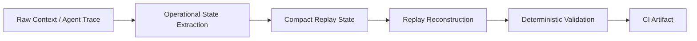

# Comptextv7

Deterministic operational memory for long-horizon AI agents.

Comptextv7 validates whether compact replay-safe operational state can preserve workflow continuity across compression, reconstruction, and CI-audited replay checks.

[](pyproject.toml)
[](https://github.com/ProfRandom92/Comptextv7/actions/workflows/ci.yml)


## Benchmark snapshot

Values below are read from committed deterministic artifacts only: [`artifacts/paper_replay_results.json`](artifacts/paper_replay_results.json) and [`artifacts/agent_trace_replay_results.json`](artifacts/agent_trace_replay_results.json).

| Benchmark | Count | Avg compression ratio | Replay consistency | Operational drift |
|---|---:|---:|---:|---:|
| Paper Replay Benchmark | 3 papers | 1.347063 | 0.791667 | Not reported |
| Agent Trace Replay Benchmark | 3 traces | 1.773954 | 1.000000 | 0.000000 |

## Architecture



## What exists now

| Capability | Status |
|---|---|
| Paper Replay Benchmark | Implemented |
| Agent Trace Replay Benchmark | Implemented |
| Deterministic Replay Metrics | Implemented |
| CI Artifact Publishing | Implemented |
| No LLM Judging | Enforced |
| No Embeddings / Vector DB | Enforced |

## Integrity model

Comptextv7 is designed for replay checks that can be inspected without trusting a live model call or opaque vector store.

- **No LLM judging:** replay quality is scored by deterministic benchmark code, not by model preference or rubric calls.
- **No embeddings:** validation does not depend on vector similarity, external embedding APIs, or vector databases.
- **No external APIs:** committed benchmark fixtures and local code produce the replay artifacts.
- **Deterministic JSON artifacts:** replay outputs are serialized for review, diffing, and CI artifact publication.
- **CI reproducible:** GitHub Actions run the validation path and publish machine-readable evidence.
- **Audit friendly:** metrics, fixture counts, and replay outputs remain inspectable in the repository.

## Limitations

- Current benchmarks use curated fixtures, not broad production traffic.
- This is not solved AI memory and does not claim general long-term recall.
- This is not an autonomous agent framework.
- Iterative replay degradation is the next validation target.
- Real-world trace coverage is still expanding.

## What is Comptextv7?

Comptextv7 is an experimental replay-state validation project. It tests whether a compact operational state can preserve the constraints, blockers, dependencies, tool sequence, and paper-specific facts needed to reconstruct useful workflow context after compression.

It is not a generic summarizer, byte-for-byte compressor, production telemetry system, vendor certification claim, or AGI memory claim.

## Reproducibility

### Primary replay-continuity benchmark

```bash
python -m pip install -e ".[test]"
python benchmarks/run_replay_continuity.py --iterations 250 --output-dir reports/replay_continuity
python -m pytest tests/test_replay_continuity.py
```

### General validation commands

```bash
python -m pytest
python scripts/validate.py replay
python scripts/validate.py token
python scripts/validate.py forensic
python benchmarks/run_kvtc_v7_benchmarks.py --iterations 1 --warmups 0
python dashboard/industrial_dashboard.py --once
```

Dashboard frontend checks:

```bash
cd dashboard/app
npm install
npm run typecheck
npm run build
npm run smoke:release-health
```

Agent/report tooling:

```bash
python scripts/repo_intake.py
python scripts/run_checks.py
python scripts/validate_contracts.py
python scripts/generate_contract_fixtures.py
python scripts/validate_api_exports.py
python scripts/generate_project_health_report.py
python scripts/generate_dashboard_health_summary.py
```

## Showcase and review surfaces

| Reviewer path | Link |
| --- | --- |
| Live showcase | <https://comptextv7.vercel.app> |
| No-local-execution demo script | [`docs/DEMO_WALKTHROUGH.md`](docs/DEMO_WALKTHROUGH.md) |
| Showcase readiness pack | [`docs/SHOWCASE_READINESS.md`](docs/SHOWCASE_READINESS.md) |
| Conservative benchmark explanation | [`docs/BENCHMARK_EXPLANATION.md`](docs/BENCHMARK_EXPLANATION.md) |
| Replay continuity report | [`reports/replay_continuity/validation_report.md`](reports/replay_continuity/validation_report.md) |
| Dashboard/API boundaries | [`docs/API_SURFACE.md`](docs/API_SURFACE.md) |

## Cloud-first validation architecture

Comptextv7 remains biased toward artifact-backed review rather than local machine trust.

| Workflow | Role |
| --- | --- |
| [`ci.yml`](.github/workflows/ci.yml) | Pytest, deterministic replay, token telemetry, semantic forensic validation, benchmark replay, and dashboard startup validation. |
| [`agent-checks.yml`](.github/workflows/agent-checks.yml) | Repository/report/contract checks plus dashboard typecheck, build, and release-health smoke coverage. |
| [`validation_runner.yml`](.github/workflows/validation_runner.yml) | Compact cloud validation result contract and artifact publishing. |

The Cloud Feedback Interface (CFI) artifact model keeps validation status small enough for dashboards, companion UIs, pull-request comments, and reviewer checklists.

| CFI item | Plain-English meaning | Primary evidence |
| --- | --- | --- |
| CFI-01 | A compact Cloud CI result contract exists for status metadata. | [`contracts/hash-chilli-cloud-ci-result.schema.json`](contracts/hash-chilli-cloud-ci-result.schema.json), [`docs/hash-companion/cloud-ci-result-contract.md`](docs/hash-companion/cloud-ci-result-contract.md) |
| CFI-02 | A GitHub Actions validation runner can produce authoritative cloud validation status. | [`.github/workflows/validation_runner.yml`](.github/workflows/validation_runner.yml), [`docs/hash-companion/validation-runner-workflow.md`](docs/hash-companion/validation-runner-workflow.md) |
| CFI-03 | The workflow publishes compact result artifacts for reviewer/companion consumption. | `validation-runner-cfi-artifacts`, `reports/hash-chilli-cloud-ci-result.json`, `reports/hash-chilli-cloud-ci-summary.json` |

## Repository map

```text
Comptextv7/
├── artifacts/                  # committed deterministic replay benchmark JSON
├── benchmarks/                 # deterministic compression, replay, and audit runners
├── contracts/                  # machine-readable handoff contracts
├── dashboard/                  # backend plus React operations console
├── datasets/golden/            # immutable synthetic replay fixtures
├── docs/                       # showcase, reports, wiki, and Hash/chilli docs
├── reports/replay_continuity/  # adversarial continuity metrics and SVG charts
├── scripts/                    # validation, reporting, and artifact tooling
├── src/                        # KVTC engine, audit, and semantic validation modules
├── tests/                      # Python regression and validation tests
└── README.md
```

## Safety boundaries

Do not commit:

- real Daimler payloads or proprietary customer data;
- secrets, API keys, tokens, cookies, or credentials;
- raw production logs;
- unsanitized replay fixtures;
- private deployment credentials or environment dumps.

Comptextv7 is a deterministic, synthetic-only research prototype for operational replay persistence and reviewable diagnostic infrastructure.
