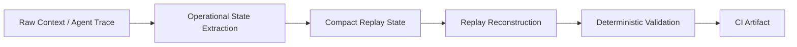

# Comptextv7

**Deterministic operational replay validation for long-horizon AI agents.**

Comptextv7 tests whether compact, replay-safe operational state can preserve workflow continuity across compression, reconstruction, and CI-audited replay checks — without LLM judges, embeddings, or external APIs.

[](pyproject.toml)
[](https://github.com/ProfRandom92/Comptextv7/actions/workflows/ci.yml)


## 30-second summary

Comptextv7 is:

- deterministic replay validation infrastructure;
- focused on operational state, not raw chat history;
- validated through committed deterministic fixtures and CI-published artifacts;
- currently covering paper replay and agent trace replay benchmarks.

## Proof points

| Proof point | Current evidence |
| --- | --- |
| Paper replay | 3 dense technical paper fixtures |
| Agent trace replay | 3 multi-step workflow traces |
| Avg paper compression | 1.347063 |
| Avg agent compression | 1.773954 |
| Replay artifacts | committed JSON + CI upload |
| Evaluation mode | deterministic, no LLM judging |

## Benchmark cards

### Paper Replay

Validates compact replay of dense technical text into deterministic survival metrics.

| Metric | Value |
| --- | ---: |
| Fixture count | 3 papers |
| Avg compression ratio | 1.347063 |
| Replay consistency | 0.791667 |

- Artifact: [`artifacts/paper_replay_results.json`](artifacts/paper_replay_results.json)
- Method: [`docs/benchmarks/paper_replay.md`](docs/benchmarks/paper_replay.md)

### Agent Trace Replay

Validates multi-step workflow continuity across active task, constraints, dependencies, blockers, and tool sequence.

| Metric | Value |
| --- | ---: |
| Fixture count | 3 traces |
| Avg compression ratio | 1.773954 |
| Replay consistency | 1.000000 |
| Operational drift | 0.000000 |

- Artifact: [`artifacts/agent_trace_replay_results.json`](artifacts/agent_trace_replay_results.json)
- Method: [`docs/benchmarks/agent_trace_replay.md`](docs/benchmarks/agent_trace_replay.md)

`1.000000` replay consistency here means exact preservation under the current structured trace fixture setup. It is near-lossless structured fixture replay, not a claim that long-term AI memory is solved.

## What makes this different?

- Not chat history storage: it validates compact operational state, not raw logs.
- Not vector memory: it does not rely on embeddings or vector databases.
- Not model-judged summarization: metrics are deterministic and artifact-backed.
- Not autonomous agent orchestration: it evaluates replay state rather than running an agent framework.
- It is deterministic operational-state replay validation.

## Architecture

Comptextv7 turns noisy context into compact operational state, then validates whether replay can reconstruct the fields needed to continue work.



| Stage | What it preserves or tests |
| --- | --- |
| Raw context / trace | Goals, constraints, blockers, chronology, dependencies, and tool sequence. |
| Operational extraction | Converts context into compact replay-safe structure. |
| Compact replay state | Stores the minimum state expected to support reconstruction. |
| Replay reconstruction | Rebuilds task context from compact state. |
| Deterministic validation | Scores continuity, drift, survival, and replay consistency. |
| CI artifact | Publishes JSON evidence for review and audit. |

## Benchmark family

### Paper Replay Benchmark

Dense paper excerpts are converted into operational extraction records, compressed into compact replay state, reconstructed, and scored for survival of entities, metrics, sections, limitations, and consistency.

### Agent Trace Replay Benchmark

Multi-step agent traces are reduced to typed workflow state: active task, constraints, dependencies, blockers, and tool sequence. Replay validation checks whether those fields survive compact reconstruction.

## Long-horizon adversarial replay

This older/parallel continuity stress suite is complementary to the newer artifact-backed paper and agent-trace benchmarks. It measures mean final continuity under adversarial replay ladders, not token compression alone.

| System | Iteration 25 | Iteration 50 | Iteration 100 | Iteration 250 |
| --- | ---: | ---: | ---: | ---: |
| Naive Replay | 0.039 | 0.039 | 0.043 | 0.039 |
| Baseline Replay | 0.294 | 0.294 | 0.294 | 0.294 |
| Adaptive Replay | 0.679 | 0.476 | 0.302 | 0.302 |
| Comptextv7 | 1.000 | 0.995 | 0.824 | 0.572 |

The 250-iteration report records Comptextv7 mean final continuity at `0.571783`; the table rounds it to `0.572`.

| System | Approx replay longevity / collapse point |
| --- | ---: |
| Naive Replay | ~1 iteration |
| Baseline Replay | ~10 iterations |
| Adaptive Replay | ~45 iterations |
| Comptextv7 | censored at ~250 iterations in this suite |

Comptextv7 did not cross the collapse threshold during the 250-iteration run, so the result is censored at 250 rather than evidence of indefinite persistence.

## Visual artifacts

Deterministic SVG reports are committed for inspection without decorative header images or broken previews.

- [`replay_degradation_curves.svg`](reports/replay_continuity/replay_degradation_curves.svg)
- [`continuity_half_life_chart.svg`](reports/replay_continuity/continuity_half_life_chart.svg)
- [`semantic_drift_graph.svg`](reports/replay_continuity/semantic_drift_graph.svg)
- [`replay_collapse_curves.svg`](reports/replay_continuity/replay_collapse_curves.svg)
- [`evaluator_agreement_divergence.svg`](reports/replay_continuity/evaluator_agreement_divergence.svg)
- [`hidden_constraint_survival_curves.svg`](reports/replay_continuity/hidden_constraint_survival_curves.svg)

## Integrity model

Comptextv7 is designed for replay checks that can be inspected without trusting a live model call or opaque vector store.

- **No LLM judging:** replay quality is scored by deterministic benchmark code.
- **No embeddings:** validation does not depend on vector similarity or vector DBs.
- **No external APIs:** committed fixtures and local code produce replay artifacts.
- **Deterministic JSON artifacts:** outputs are serialized for diffing and CI.
- **CI reproducible:** GitHub Actions publish machine-readable validation evidence.
- **Audit friendly:** metrics, fixture counts, and replay outputs remain inspectable.

## Important limitations

- Benchmarks use curated deterministic fixtures, not broad production traffic.
- Structured agent traces currently replay near-losslessly because fields are typed.
- Stronger iterative degradation pressure is still pending for the newer benchmarks.
- This is not a production telemetry system or autonomous agent framework.
- This does not claim solved memory; replay fidelity still degrades under pressure.
- In the 250-iteration suite, hidden truth survival is `0.570173` and evaluator divergence remains material at `0.421743`.
- No vendor certification or proprietary-data integration is claimed.

> Next milestone: iterative replay degradation.
> Repeatedly compact and replay operational state to expose drift curves, collapse points, and field-level failure modes under pressure.

## Why this matters

Replay-safe operational state is relevant to systems that must continue work beyond a single context window:

- coding agents preserving architecture decisions, blockers, and reviewer constraints;
- long-running copilots resuming workflows without rewriting task history;
- persistent workflow agents handing off state between sessions, tools, and operators;
- enterprise assistants preserving audit-sensitive constraints and chronology.

The goal is to measure whether replayed operational state remains trustworthy enough to continue work.

## Research direction

| Area | Next step |
| --- | --- |
| Iterative degradation | Extend replay ladders and report degradation curves, not just endpoints. |
| Entailment checks | Verify reconstructed states still entail original constraints and truths. |
| Hidden truth verification | Stress facts that are easy to omit but operationally critical. |
| Graph operational state | Preserve owners, dependencies, temporal edges, and blockers. |
| External validation | Add independent judges with transparent disagreement reporting. |
| Trace coverage | Expand real-world-style traces while preserving privacy boundaries. |

## Showcase / review surfaces

| Reviewer path | Link |
| --- | --- |
| Live showcase | <https://comptextv7.vercel.app> |
| No-local-execution demo script | [`docs/DEMO_WALKTHROUGH.md`](docs/DEMO_WALKTHROUGH.md) |
| Showcase readiness pack | [`docs/SHOWCASE_READINESS.md`](docs/SHOWCASE_READINESS.md) |
| Conservative benchmark explanation | [`docs/BENCHMARK_EXPLANATION.md`](docs/BENCHMARK_EXPLANATION.md) |
| Replay continuity report | [`reports/replay_continuity/validation_report.md`](reports/replay_continuity/validation_report.md) |
| Dashboard/API boundaries | [`docs/API_SURFACE.md`](docs/API_SURFACE.md) |

## Cloud-first validation

Comptextv7 remains biased toward artifact-backed review rather than local machine trust.

| Workflow | Role |
| --- | --- |
| [`ci.yml`](.github/workflows/ci.yml) | Pytest, deterministic replay, token telemetry, benchmark replay, and dashboard startup validation. |
| [`agent-checks.yml`](.github/workflows/agent-checks.yml) | Repository/report/contract checks plus dashboard typecheck, build, and smoke coverage. |
| [`validation_runner.yml`](.github/workflows/validation_runner.yml) | Compact cloud validation result contract and artifact publishing. |

The Cloud Feedback Interface (CFI) model publishes compact validation status for dashboards, companion UIs, pull-request comments, and reviewer checklists.

## Reproducibility

```bash
python -m pip install -e ".[test]"
python -m pytest
python scripts/validate.py replay
python benchmarks/run_replay_continuity.py --iterations 250 --output-dir reports/replay_continuity
```
