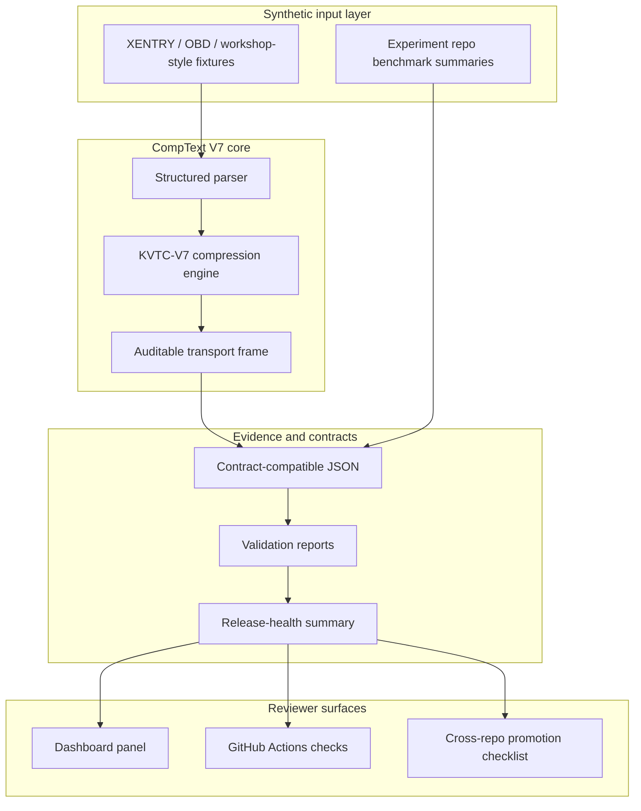
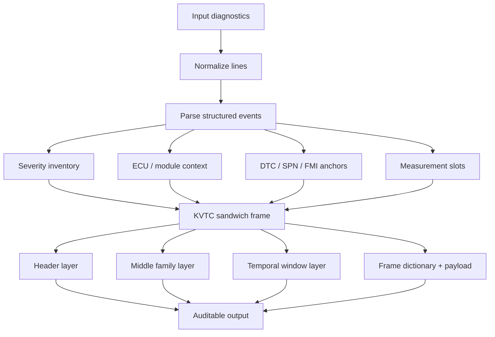
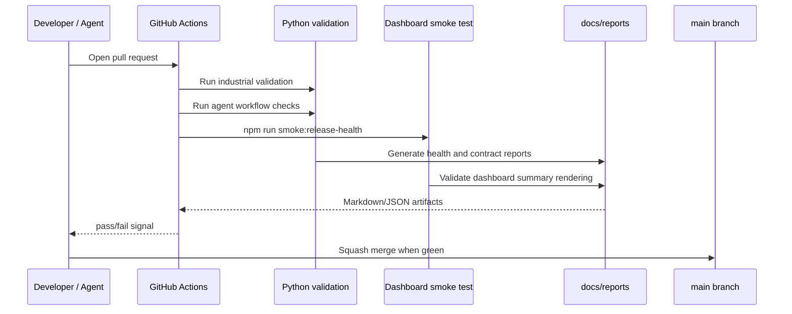

# CompText V7 — KVTC Cognitive Fabric for Technical Logs

[](https://github.com/ProfRandom92/Comptextv7/actions/workflows/ci.yml)
[](https://github.com/ProfRandom92/Comptextv7/actions/workflows/agent-checks.yml)

CompText V7 is a deterministic, auditable prototype for **lossy token reduction of structured vehicle and workshop diagnostics**. Its core KVTC-V7 engine converts synthetic XENTRY-, OBD-, and workshop-style logs into compact transport frames for assistant handoff, audit workflows, dashboards, and downstream validation.

The project is written for a Daimler-Truck-style industrial review posture without claiming vendor certification or affiliation. All benchmark, dashboard, and release-readiness examples in this repository are synthetic/static unless explicitly stated otherwise.

## Executive snapshot

| Area | Status | Notes |
| --- | --- | --- |
| KVTC compression engine | Active | Deterministic four-layer frame: header, middle family layer, temporal window, compact payload. |
| Validation pipeline | Active | Pytest, deterministic replay, token telemetry, forensic validation, benchmark replay, dashboard startup validation. |
| Dashboard | Active | React SRE/ML-Ops console plus stdlib backend for API/export and static bundle hosting. |
| Contract layer | Active | Machine-readable JSON handoff contracts, generated fixtures, API/export validation, and report summaries. |
| Release health | Active | Generated Markdown/JSON reports, dashboard health panel, smoke test, and CI integration. |
| Data posture | Synthetic-only | No real Daimler payloads, secrets, raw production logs, or proprietary customer data should be committed. |

## System architecture



## KVTC processing model



| Layer | Purpose | Examples retained |
| --- | --- | --- |
| Header | Run-level inventory and provenance. | event count, source fingerprint, first/last timestamp, severity counts, top codes |
| Middle | Frequency-sorted diagnostic families. | `ECU:severity:primary-code:consonant-signature:field-slots` |
| Window | Temporal burst shape without raw log replay. | top window buckets and family counts |
| Frame | Transport representation. | deterministic family dictionary plus compact JSON payload, or sparse micro-frame for tiny heterogeneous packets |

## Validation and release-health pipeline



Release readiness is generated from synthetic/static project health artifacts. It does not include real Daimler data, secrets, customer data, or raw production logs.

| Surface | Entrypoint |
| --- | --- |
| Machine-readable release health source | [`docs/reports/dashboard-health-summary.json`](docs/reports/dashboard-health-summary.json) |
| Human-readable release health report | [`docs/reports/dashboard-health-summary.md`](docs/reports/dashboard-health-summary.md) |
| Dashboard panel | `Release Health Summary` |
| Local smoke test | `cd dashboard/app && npm run smoke:release-health` |
| CI workflow | [`.github/workflows/agent-checks.yml`](.github/workflows/agent-checks.yml) |
| Agent workflow | [`docs/AGENT_WORKFLOW.md`](docs/AGENT_WORKFLOW.md) |
| Cross-repo promotion checklist | [`docs/CROSS_REPO_RELEASE_CHECKLIST.md`](docs/CROSS_REPO_RELEASE_CHECKLIST.md) |

## Repository map

```text
Comptextv7/
├── benchmarks/                     # deterministic compression and audit runners
├── contracts/                      # machine-readable API/report handoff contracts
├── dashboard/
│   ├── industrial_dashboard.py     # stdlib API/export backend and static bundle host
│   └── app/                        # React SRE/ML-Ops operations console
├── datasets/golden/                # immutable synthetic replay fixtures
├── docs/
│   ├── reports/                    # generated validation and release-health reports
│   └── wiki/                       # indexed architecture, governance, and runbook docs
├── scripts/                        # validation, fixture generation, health/report tooling
├── src/                            # KVTC engine, audit, and validation modules
├── tests/                          # Python regression and validation tests
├── pyproject.toml
└── README.md
```

## Quick start

Install the package with test dependencies:

```bash
python -m pip install -e ".[test]"
```

Run the Python validation suite:

```bash
python -m pytest
```

Run the compression benchmark:

```bash
python benchmarks/run_kvtc_v7_benchmarks.py --iterations 5 --warmups 1
```

Emit JSON for CI artifacts or dashboards:

```bash
python benchmarks/run_kvtc_v7_benchmarks.py --iterations 5 --warmups 1 --json
```

Run the industrial audit scorecard:

```bash
python benchmarks/run_industrial_audit.py --iterations 3
```

Run the industrial operations dashboard API/export backend:

```bash
python dashboard/industrial_dashboard.py --host 127.0.0.1 --port 8765
```

Build or develop the React SRE/ML-Ops console:

```bash
cd dashboard/app
npm install
npm run dev
# or: npm run build
```

Run the release-health dashboard smoke test:

```bash
cd dashboard/app
npm run smoke:release-health
```

## Agent and contract commands

These commands are designed to be CI-friendly, deterministic, and safe for future agents:

```bash
python scripts/repo_intake.py
python scripts/run_checks.py
python scripts/validate_contracts.py
python scripts/generate_contract_fixtures.py
python scripts/validate_api_exports.py
python scripts/generate_project_health_report.py
python scripts/generate_dashboard_health_summary.py
```

Generated reports are written under [`docs/reports/`](docs/reports/) and are intended for review, release gating, and dashboard consumption.

## Cross-repo experiment handoff

CompText V7 consumes only **contract-compatible, sanitized, synthetic summaries** from [`ProfRandom92/Comptext-Daimler-Experiment-`](https://github.com/ProfRandom92/Comptext-Daimler-Experiment-). The experiment repository owns benchmark, regression, sanitization, and forensic replay outputs. This runtime repository owns API contracts, dashboard presentation, validation gates, and release-readiness summaries.

Required experiment-side artifacts for promotion review:

| Artifact | Purpose |
| --- | --- |
| `benchmark-summary.json` | Synthetic benchmark result summary. |
| `regression-summary.json` | Conservative regression decision summary. |
| `sanitization-summary.json` | Fixture/report sanitization summary. |
| `report-contract-validation-report.md` | Structural validation of report contracts. |

Promotion rules are documented in [`docs/CROSS_REPO_RELEASE_CHECKLIST.md`](docs/CROSS_REPO_RELEASE_CHECKLIST.md). No runtime coupling to the experiment repository is required.

## Benchmark snapshot

Measured in this repository on **2026-05-10** with:

```bash
python benchmarks/run_kvtc_v7_benchmarks.py --iterations 5 --warmups 1
```

| case | lines | input bytes | payload bytes | original tokens | compressed tokens | reduction | median ms | lines/s | peak KiB | distinct families | top-family coverage | interpretation |
| --- | ---: | ---: | ---: | ---: | ---: | ---: | ---: | ---: | ---: | ---: | ---: | --- |
| repetitive_xentry_2k | 2000 | 345326 | 998 | 33998 | 139 | 99.59% | 1070.06 | 1869 | 4899.7 | 6 | 100.00% | Best case: repeated families compress extremely well. |
| mixed_obd_workshop_1_5k | 1500 | 142738 | 1281 | 13804 | 155 | 98.88% | 555.42 | 2701 | 2379.4 | 10 | 100.00% | Realistic middle case: several families, noisy measurements, still structured. |
| high_entropy_json_750 | 750 | 179617 | 2509 | 21000 | 113 | 99.46% | 501.40 | 1496 | 1684.6 | 750 | 1.60% | Weak case: apparent reduction is lossy and requires quality gates. |
| short_sparse_3 | 3 | 202 | 61 | 23 | 8 | 65.22% | 1.16 | 2593 | 5.9 | 3 | 100.00% | Sparse edge case: micro-frame prevents metadata overhead from dominating tiny inputs. |

Read benchmark results conservatively. High compression is not proof of semantic fidelity; top-family coverage, forensic replay, regression summaries, and downstream validation must be reviewed together.

## Design posture

CompText V7 is an industrial diagnostic fabric rather than a generic text zipper:

1. **Workshop semantics first** — severity, ECU/module, DTC/SPN/FMI codes, and measurements are parsed before compression.
2. **Token economy** — repeated language is collapsed into domain abbreviations and consonant skeletons while diagnostic anchors remain reviewable.
3. **Burst awareness** — temporal windows preserve when fault families cluster for triage and production support.
4. **Data-sovereign edge readiness** — deterministic local execution supports review before cloud upload or assistant handoff.
5. **Governance by artifacts** — reports, schemas, fixtures, and smoke tests provide reviewable release evidence.

## Documentation hub

| Document | Purpose |
| --- | --- |
| [`docs/API_SURFACE.md`](docs/API_SURFACE.md) | Dashboard/API/export route and payload boundaries. |
| [`docs/AGENT_WORKFLOW.md`](docs/AGENT_WORKFLOW.md) | Safe branch, PR, and validation workflow for future agents. |
| [`docs/BENCHMARK_INTEGRATION.md`](docs/BENCHMARK_INTEGRATION.md) | How benchmark/regression findings flow into CompText V7. |
| [`docs/CROSS_REPO_RELEASE_CHECKLIST.md`](docs/CROSS_REPO_RELEASE_CHECKLIST.md) | Go/no-go and rollback criteria for experiment-to-runtime promotion. |
| [`docs/wiki/README.md`](docs/wiki/README.md) | Structured wiki navigation for architecture, governance, runbook, and roadmap material. |
| [`dashboard/app/README.md`](dashboard/app/README.md) | Frontend architecture and dashboard implementation notes. |

## Safety boundaries

Never commit:

- real Daimler payloads or proprietary customer data
- secrets, API keys, tokens, cookies, or credentials
- raw production logs
- unsanitized replay fixtures
- private deployment credentials or environment dumps

Synthetic fixtures and generated summaries are acceptable when they are deterministic, sanitized, and safe to review.

## Caveats

- KVTC-V7 is intentionally **lossy**. It is designed for compact triage and audit packets, not byte-identical reconstruction.
- The datasets are synthetic and deterministic. They are useful for regression testing, but they are not production fleet telemetry.
- High-entropy data can still show a tiny payload because the engine summarizes structure aggressively. Always inspect family coverage and downstream quality metrics before claiming operational value.
