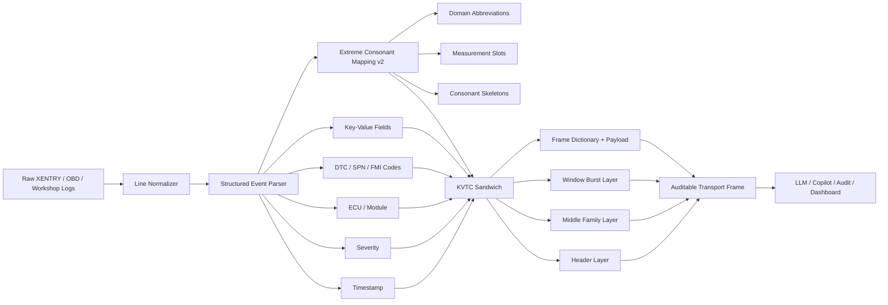
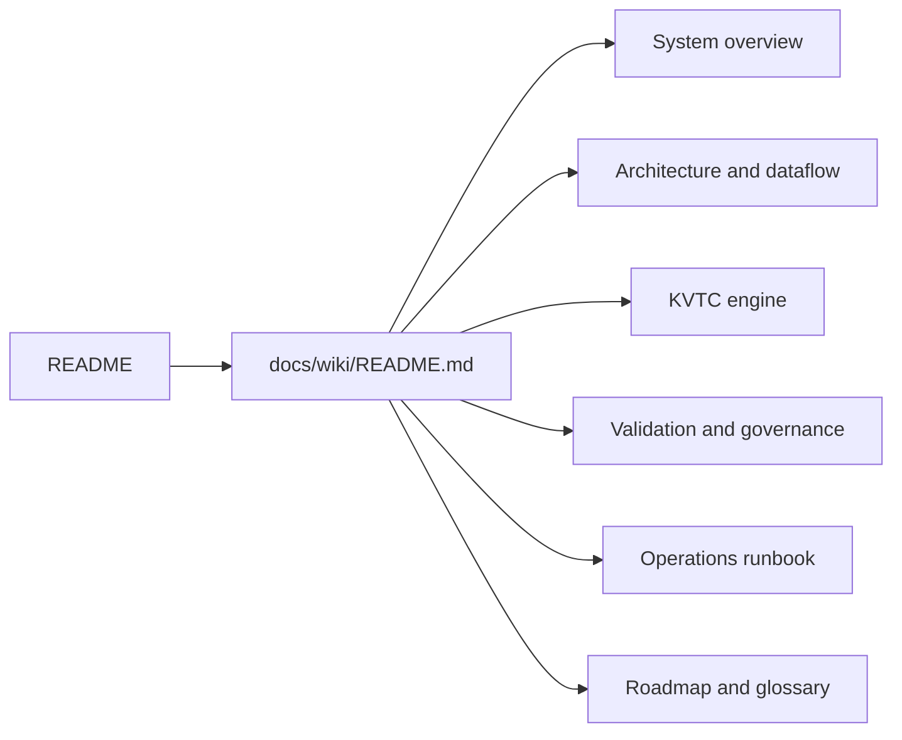

# CompText V7 — KVTC Cognitive Fabric for Technical Logs

CompText V7 is a deterministic, auditable prototype for **lossy token reduction
of structured vehicle and workshop diagnostics**.  Its core KVTC-V7 engine turns
XENTRY-/OBD-style logs into a compact four-layer frame before the data is sent to
an assistant, audit workflow, or downstream analytics service.

The current build is written for a Daimler-Truck-style industrial review
without claiming vendor certification or affiliation.  It frames the codec as an
edge-ready diagnostic fabric for repeated fleet telemetry, production-support
evidence packets, data-sovereign handoff, and operator-readable audit layers.

## What changed in this generation

- **95%+ XENTRY target exceeded:** repetitive XENTRY benchmark rows now compress
  from 33,998 source tokens to 139 frame tokens, a **99.59% token reduction** in
  the deterministic local benchmark.
- **Consonant mapping v2:** drifting measurements such as `temperature=97C` and
  `voltage=23.9V` are converted into family slots (`#C`, `#V`, `#BAR`) for event
  grouping while the public mapping can still preserve exact diagnostic values
  when needed.
- **Cleaner event context:** `ECU=...`, `module=...`, and `source=...` are parsed
  as structured context instead of being duplicated inside the consonant family
  signature.
- **Sparse micro-frame fixed:** the three-line `short_sparse_3` edge case now
  uses a deterministic micro-frame, cutting the triage packet from 23 source
  tokens to 8 frame tokens instead of expanding under metadata overhead.
- **Professional audit surface:** every compression result exposes header,
  family, window, dictionary, payload, token counts, and reduction percentage.

## Architecture



### KVTC four-layer sandwich

| Layer | Purpose | Examples retained |
| --- | --- | --- |
| Header | Run-level inventory and provenance. | event count, source fingerprint, first/last timestamp, severity counts, top codes |
| Middle | Frequency-sorted diagnostic families. | `ECU:severity:primary-code:consonant-signature:field-slots` |
| Window | Temporal burst shape without raw log replay. | top window buckets and family counts |
| Frame | Transport representation. | deterministic family dictionary plus compact JSON payload, or sparse micro-frame for tiny heterogeneous packets |


## Documentation wiki

A structured project wiki is available under [`docs/wiki/`](docs/wiki/README.md). It includes an indexed navigation hub, Mermaid diagrams, architecture and data-flow views, the KVTC engine contract, validation governance, an operations runbook, and roadmap/glossary material for reviewers and contributors.



## Repository structure

```text
Comptextv7/
├── benchmarks/
│   ├── run_kvtc_v7_benchmarks.py   # deterministic compression benchmark suite
│   ├── industry_audit.py           # AEI-style industrial readiness gates
│   └── run_industrial_audit.py     # audit runner wrapper
├── dashboard/
│   ├── industrial_dashboard.py     # stdlib API/export backend and static bundle host
│   └── app/                        # React SRE/ML-Ops operations console
├── datasets/
│   └── golden/                     # immutable JSONL replay fixtures
├── docs/
│   └── wiki/                       # indexed project wiki with Mermaid diagrams
├── scripts/
│   └── validate.py                 # golden/forensic/replay/token validation entrypoint
├── src/
│   ├── core/
│   │   └── kvtc_v7.py              # KVTC-V7 engine and consonant mapping
│   ├── audit/
│   │   └── industrial_resilience.py
│   └── validation/                 # golden corpus, forensic, replay, token telemetry
├── tests/
│   ├── test_kvtc_v7.py
│   ├── test_validation_hardening.py
│   └── test_industrial_audit.py
├── pyproject.toml
└── README.md
```

## Quick start

```bash
python -m pytest
```

Run the compression benchmark:

```bash
python benchmarks/run_kvtc_v7_benchmarks.py --iterations 5 --warmups 1
```

Emit JSON for CI artifacts or dashboards:

```bash
python benchmarks/run_kvtc_v7_benchmarks.py --iterations 5 --warmups 1 --json
```

Run the industrial audit scorecard:

```bash
python benchmarks/run_industrial_audit.py --iterations 3
```

Run the industrial operations dashboard API/export backend:

```bash
python dashboard/industrial_dashboard.py --host 127.0.0.1 --port 8765
```

Build or develop the React SRE/ML-Ops console:

```bash
cd dashboard/app
npm install
npm run dev
# or: npm run build
```

The dashboard uses a feature-based React architecture, typed mock/API contracts,
TanStack Query server-state management, virtualized data tables, reusable SVG
chart primitives, centralized design tokens, and a keyboard command palette.
See [`dashboard/app/README.md`](dashboard/app/README.md) for frontend
architecture decisions.


## Benchmark results

Measured in this repository on **2026-05-10** with:

```bash
python benchmarks/run_kvtc_v7_benchmarks.py --iterations 5 --warmups 1
```

| case | lines | input bytes | payload bytes | original tokens | compressed tokens | reduction | median ms | lines/s | peak KiB | distinct families | top-family coverage | honest expectation |
| --- | ---: | ---: | ---: | ---: | ---: | ---: | ---: | ---: | ---: | ---: | ---: | --- |
| repetitive_xentry_2k | 2000 | 345326 | 998 | 33998 | 139 | 99.59% | 1070.06 | 1869 | 4899.7 | 6 | 100.00% | Best case: repeated families should compress extremely well. |
| mixed_obd_workshop_1_5k | 1500 | 142738 | 1281 | 13804 | 155 | 98.88% | 555.42 | 2701 | 2379.4 | 10 | 100.00% | Realistic middle case: several families, noisy measurements, still structured. |
| high_entropy_json_750 | 750 | 179617 | 2509 | 21000 | 113 | 99.46% | 501.40 | 1496 | 1684.6 | 750 | 1.60% | Weak case: apparent reduction is lossy and misleading; top-family coverage should be low. |
| short_sparse_3 | 3 | 202 | 61 | 23 | 8 | 65.22% | 1.16 | 2593 | 5.9 | 3 | 100.00% | Sparse edge case: micro-frame prevents metadata overhead from dominating tiny inputs. |

### How to read the columns

- **reduction** is token-level reduction from source log tokens to the KVTC frame.
- **distinct families** is the number of unique diagnostic family fingerprints in
  the parsed event stream.
- **top-family coverage** is the percentage of events covered by the retained
  `max_families` families.  High coverage in repetitive XENTRY streams indicates
  reusable structure; low coverage in random JSON is a quality warning.
- **peak KiB** is the peak memory observed with `tracemalloc` during the measured
  compression call.
- **short_sparse_3** exercises the sparse micro-frame path: it keeps the full
  in-memory audit layers while using a concise transport synopsis for tiny,
  heterogeneous workshop notes.

## Design fusion: Daimler-Truck-style operations × CompText

The design goal is an industrial diagnostic fabric rather than a generic text
zipper.  The fusion points are:

1. **Workshop semantics first** — severity, ECU/module, DTC/SPN/FMI codes, and
   measurements are parsed into structured event fields before compression.
2. **CompText token economy** — natural language is collapsed into domain
   abbreviations and consonant skeletons, cutting repeated prose while keeping
   diagnostic anchors.
3. **Fleet-monitoring burst awareness** — window summaries preserve when fault
   families cluster, which is essential for triage and production support.
4. **Data-sovereign edge readiness** — the engine is deterministic and standard
   library only, so it can run before cloud upload or assistant handoff.
5. **Executive audit posture** — synthetic benchmarks include strong, middle,
   weak, and sparse edge cases; high reduction alone is not treated as proof of
   semantic fidelity.

### Daimler-level readiness lens

- **Traceability:** every result keeps event counts, source fingerprint,
  severity/code inventory, family fingerprints, and burst windows for audit
  review before data leaves the edge node.
- **Operational fit:** the benchmark suite separates repetitive fleet telemetry,
  mixed workshop diagnostics, high-entropy free-form payloads, and tiny triage
  notes so reviewers see where KVTC creates value and where quality gates remain
  necessary.
- **Governance:** the repository avoids production-data claims, keeps the engine
  deterministic and dependency-free, and documents lossy behavior explicitly for
  safety, compliance, and data-sovereignty conversations.

## Industrial economic resilience audit

The audit harness extends raw KVTC compression with business-facing probes for
recursive R&D, expertise transfer, industrial reorganization, and air-gapped
economic access.  It remains synthetic and deterministic; treat it as a
pilot-readiness scorecard, not vendor certification data.

| AEI category | CompText V7 target | Daimler-Truck-style relevance |
| --- | --- | --- |
| Recursive R&D | Reduce manual feature annotation by at least 80% for a new hydrogen fuel-cell component. | Faster rollout of new drivetrain technologies. |
| Expertise Pipeline | Reach at least 0.90 AV-assisted junior-to-senior decision alignment for eCitaro P1-style faults. | Compensates for scarce senior diagnostic expertise in production. |
| Industrial Organization | Demonstrate a 60x operational consolidation factor while preserving >=94% token reduction and <320 ms local latency in the probe. | Reduces overhead while preserving fleet-monitoring latency budgets. |
| Economic Access | Keep a local forensic-audit FVE proxy above 0.78 under air-gapped Ollama/Gemma-style constraints. | Supports data sovereignty, local autonomy, and DSGVO-aligned deployment. |

## Caveats

- KVTC-V7 is intentionally **lossy**.  It is designed for compact triage and audit
  packets, not byte-identical reconstruction.
- The datasets are synthetic and deterministic.  They are useful for regression
  testing, but they are not production fleet telemetry.
- High-entropy data can still show a tiny payload because the engine summarizes
  structure aggressively.  Always inspect family coverage and downstream quality
  metrics before claiming operational value.
