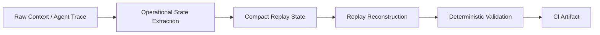

# Comptextv7

**Deterministic operational replay validation for long-horizon AI agents.**

Comptextv7 tests whether compact, replay-safe operational state can preserve
workflow continuity across compression, reconstruction, and CI-audited replay
checks — without LLM judges, embeddings, vector databases, or external APIs.

[](pyproject.toml)
[](https://github.com/ProfRandom92/Comptextv7/actions/workflows/ci.yml)


## Why this exists

Long-running agents fail when replayed context becomes operationally
untrustworthy:

- constraints disappear;
- blockers detach from tasks;
- tool sequences mutate;
- dependencies collapse;
- summaries sound fluent but lose actionable state.

Comptextv7 focuses on preserving the state needed to continue work, not
preserving raw chat history.

## Proof at a glance

| Evidence | Current result |
| --- | --- |
| Paper replay fixtures | 3 dense technical papers |
| Agent trace fixtures | 3 multi-step workflows |
| Paper avg compression | 1.347063 |
| Agent avg compression | 1.773954 |
| Paper replay consistency | 0.791667 |
| Agent replay consistency | 1.000000 |
| Agent operational drift | 0.000000 |
| Evaluation mode | deterministic, no LLM judging |
| Artifact format | committed JSON + CI upload |

## How to read the benchmark values

- Paper replay is lossy and more realistic under dense technical prose.
- Agent trace replay is currently near-lossless because fixtures are structured.
- `1.000000` replay consistency does not mean solved memory.
- It means exact preservation under the current structured trace fixture setup.
- The next milestone is iterative replay degradation pressure.

## What makes this different

- Not chat-history storage.
- Not vector memory.
- Not model-judged summarization.
- Not autonomous agent orchestration.
- Deterministic operational-state replay validation.

## Architecture

Comptextv7 turns noisy context into compact operational state, then validates
whether replay reconstructs the fields needed to continue work.



| Stage | What it preserves or tests |
| --- | --- |
| Raw context / trace | Goals, constraints, blockers, chronology, dependencies, tool sequence. |
| Operational extraction | Converts context into compact replay-safe structure. |
| Compact replay state | Stores the minimum state expected to support reconstruction. |
| Replay reconstruction | Rebuilds task context from compact state. |
| Deterministic validation | Scores continuity, drift, survival, and replay consistency. |
| CI artifact | Publishes JSON evidence for review and audit. |

## Benchmark family

### Paper Replay Benchmark

Dense technical paper excerpts are converted into typed operational state and
compressed/replayed with deterministic survival metrics.

| Field | Current value |
| --- | --- |
| Artifact | [`artifacts/paper_replay_results.json`](artifacts/paper_replay_results.json) |
| Method doc | [`docs/benchmarks/paper_replay.md`](docs/benchmarks/paper_replay.md) |
| Avg compression | 1.347063 |
| Replay consistency | 0.791667 |

### Agent Trace Replay Benchmark

Multi-step coding-agent traces are converted into active task, constraints,
dependencies, tool sequence, blockers, and recovery actions.

| Field | Current value |
| --- | --- |
| Artifact | [`artifacts/agent_trace_replay_results.json`](artifacts/agent_trace_replay_results.json) |
| Method doc | [`docs/benchmarks/agent_trace_replay.md`](docs/benchmarks/agent_trace_replay.md) |
| Avg compression | 1.773954 |
| Replay consistency | 1.000000 |
| Operational drift | 0.000000 |

Current agent-trace fixtures are structured, so this benchmark is near-lossless
under the present setup. It is useful evidence for typed workflow replay, not a
claim of general memory.

## Long-horizon adversarial replay

Complementary stress suite: this older/parallel benchmark measures continuity
under adversarial replay ladders. It does not replace the newer artifact-backed
paper and agent-trace benchmarks.

| System | Iteration 25 | Iteration 50 | Iteration 100 | Iteration 250 |
| --- | ---: | ---: | ---: | ---: |
| Naive Replay | 0.039 | 0.039 | 0.043 | 0.039 |
| Baseline Replay | 0.294 | 0.294 | 0.294 | 0.294 |
| Adaptive Replay | 0.679 | 0.476 | 0.302 | 0.302 |
| Comptextv7 | 1.000 | 0.995 | 0.824 | 0.572 |

The 250-iteration report records Comptextv7 mean final continuity at `0.571783`;
the table rounds it to `0.572`.

| System | Approx replay longevity / collapse point |
| --- | ---: |
| Naive Replay | ~1 iteration |
| Baseline Replay | ~10 iterations |
| Adaptive Replay | ~45 iterations |
| Comptextv7 | censored at ~250 iterations in this suite |

The Comptextv7 result is censored at 250 because collapse was not observed by
that point in this suite; it is not evidence of indefinite persistence.

## Visual artifacts

- [`replay_degradation_curves.svg`](reports/replay_continuity/replay_degradation_curves.svg)
- [`continuity_half_life_chart.svg`](reports/replay_continuity/continuity_half_life_chart.svg)
- [`semantic_drift_graph.svg`](reports/replay_continuity/semantic_drift_graph.svg)
- [`replay_collapse_curves.svg`](reports/replay_continuity/replay_collapse_curves.svg)
- [`evaluator_agreement_divergence.svg`](reports/replay_continuity/evaluator_agreement_divergence.svg)
- [`hidden_constraint_survival_curves.svg`](reports/replay_continuity/hidden_constraint_survival_curves.svg)

## Integrity model

- **No LLM judging:** replay quality is scored by deterministic benchmark code.
- **No embeddings:** validation does not depend on vector similarity or vector DBs.
- **No external APIs:** committed fixtures and local code produce replay artifacts.
- **Deterministic JSON artifacts:** outputs are serialized for diffing and CI.
- **CI reproducible:** GitHub Actions publish machine-readable validation evidence.
- **Audit friendly:** metrics, fixture counts, and replay outputs remain inspectable.

## Limitations

- Benchmarks use curated deterministic fixtures, not broad production traffic.
- Structured agent traces currently replay near-losslessly because fields are typed.
- This is not solved AI memory, production telemetry, or autonomous orchestration.
- Evaluator divergence remains material in the 250-iteration stress suite.
- Iterative degradation pressure is the next benchmark target.
- No vendor certification or proprietary-data integration is claimed.

## Next technical milestone

> Next: iterative replay degradation.
> Repeatedly compact and replay operational state to expose drift curves,
> collapse points, and field-level failure modes under pressure.

## Why this matters

Replay-safe operational state is relevant to coding agents, long-running
copilots, workflow handoffs, and enterprise assistants that must preserve
constraints, blockers, dependencies, and chronology beyond a single context
window.

## Research direction

| Area | Next step |
| --- | --- |
| Iterative degradation | Extend replay ladders and report field-level degradation curves. |
| Entailment checks | Verify reconstructed states still entail original constraints and truths. |
| Hidden truth verification | Stress facts that are easy to omit but operationally critical. |
| Graph operational state | Preserve owners, dependencies, temporal edges, and blockers. |
| External validation | Add independent judges with transparent disagreement reporting. |
| Trace coverage | Expand real-world-style traces while preserving privacy boundaries. |

## Review surfaces

| Reviewer path | Link |
| --- | --- |
| Live showcase | <https://comptextv7.vercel.app> |
| Demo walkthrough | [`docs/DEMO_WALKTHROUGH.md`](docs/DEMO_WALKTHROUGH.md) |
| Showcase readiness | [`docs/SHOWCASE_READINESS.md`](docs/SHOWCASE_READINESS.md) |
| Benchmark explanation | [`docs/BENCHMARK_EXPLANATION.md`](docs/BENCHMARK_EXPLANATION.md) |
| Replay report | [`reports/replay_continuity/validation_report.md`](reports/replay_continuity/validation_report.md) |
| API surface | [`docs/API_SURFACE.md`](docs/API_SURFACE.md) |

## Cloud-first validation

Comptextv7 remains biased toward artifact-backed review rather than local machine
trust.

| Workflow | Role |
| --- | --- |
| [`ci.yml`](.github/workflows/ci.yml) | Pytest, deterministic replay, token telemetry, benchmark replay, dashboard startup validation. |
| [`agent-checks.yml`](.github/workflows/agent-checks.yml) | Repository/report/contract checks plus dashboard typecheck, build, smoke coverage. |
| [`validation_runner.yml`](.github/workflows/validation_runner.yml) | Compact cloud validation result contract and artifact publishing. |

## Reproducibility

```bash
python -m pip install -e ".[test]"
python -m pytest
python scripts/validate.py replay
python benchmarks/run_replay_continuity.py --iterations 250 --output-dir reports/replay_continuity
```
