# Comptextv7 — Semantic Continuity & Operational Replay Persistence

<p align="center">
  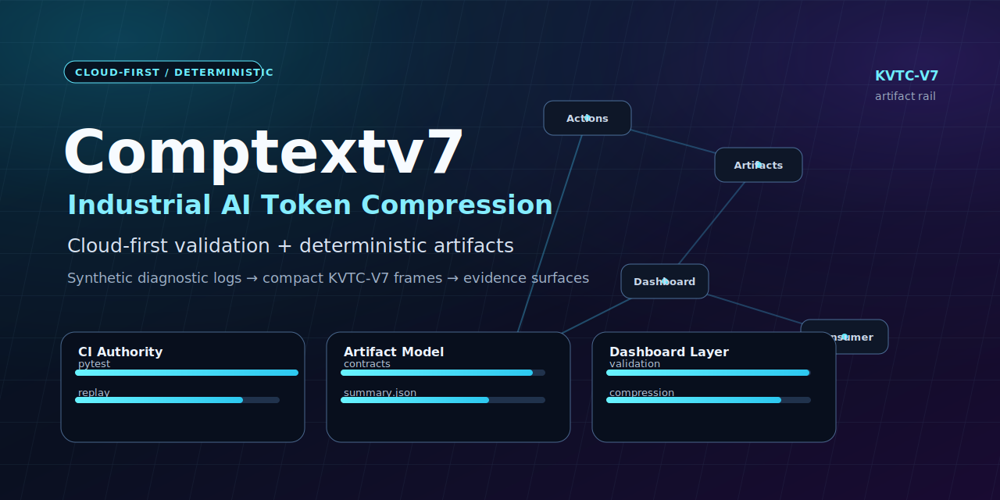
</p>

<p align="center">
  <strong>Comptextv7 explores whether structured semantic replay states can preserve operational continuity dramatically longer than traditional replay compression systems.</strong>
</p>

<p align="center">
  <a href="https://github.com/ProfRandom92/Comptextv7/actions/workflows/ci.yml"></a>
  <a href="https://github.com/ProfRandom92/Comptextv7/actions/workflows/agent-checks.yml"></a>
  <a href="https://github.com/ProfRandom92/Comptextv7/actions/workflows/validation_runner.yml"></a>
</p>

<p align="center">
  
  
  
  
  
  
</p>

<p align="center">
  <a href="https://comptextv7.vercel.app"><strong>Live Vercel showcase</strong></a>
  · <a href="docs/DEMO_WALKTHROUGH.md">Reviewer walkthrough</a>
  · <a href="reports/replay_continuity/validation_report.md">Replay continuity report</a>
  · <a href="docs/BENCHMARK_EXPLANATION.md">Benchmark interpretation</a>
</p>

---

## What is Comptextv7?

Comptextv7 is an experimental semantic continuity research framework exploring whether structured semantic replay states degrade more gracefully than traditional replay compression systems.

It is **not primarily**:

- a generic token reduction project;
- a summarizer;
- a byte-for-byte compressor;
- a claim that AI memory is solved.

It is evolving toward:

- **semantic replay persistence** — preserving the meaning-bearing state needed to continue work after context loss;
- **operational continuity retention** — keeping constraints, sequence, architecture, and hidden truths usable across replay cycles;
- **long-horizon semantic state preservation** — measuring how replay states survive repeated reconstruction and recompression;
- **replay stabilization** — reducing semantic drift under adversarial mutation;
- **adversarial continuity resilience** — exposing collapse modes instead of hiding them behind a single optimistic score.

The current implementation still includes deterministic diagnostic-frame infrastructure, synthetic fixtures, dashboards, CI artifacts, and compression-oriented history. The research direction is broader: **operational replay states that remain useful after context windows, summaries, or agent handoffs would otherwise fragment the work.**

---

## The problem: replay collapse in long-running agents

Modern long-running agents and copilots often fail before they run out of compute. They fail because replayed context becomes operationally untrustworthy.

Traditional replay systems can:

- drift semantically while appearing coherent;
- lose hidden constraints such as missing approvals, forbidden assumptions, or unresolved blockers;
- mutate architecture understanding after repeated summaries;
- collapse chronology and dependency order;
- degrade recursively as every replay becomes the source for the next replay;
- preserve tokens while losing the reason those tokens mattered.

This creates practical failure modes:

| Failure mode | Operational impact |
| --- | --- |
| Replay collapse | The system can no longer continue the original task safely. |
| Context fragmentation | Key decisions, constraints, and owners separate from the work they govern. |
| Operational forgetting | The agent forgets what must not change, not just what should be done. |
| Semantic degradation | The replay looks plausible but no longer entails the original state. |
| Recursive recompression | Each replay cycle amplifies previous omissions and distortions. |

Comptextv7 investigates whether explicit semantic clusters, operational anchors, hidden-truth checks, temporal order, and replay-state evaluation can survive longer than naive or baseline replay compression.

---

## Core architecture

The research pipeline treats replay as a state-preservation problem rather than a simple text-shortening problem.

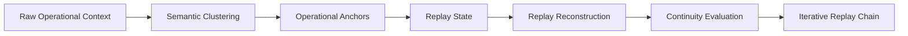

| Stage | What it preserves or tests |
| --- | --- |
| Raw operational context | Source chronology, goals, constraints, architecture, owners, and domain facts. |
| Semantic clustering | Related goals, constraints, architecture nodes, temporal events, and hidden truths. |
| Operational anchoring | The non-negotiable task details that must survive replay. |
| Replay state generation | A structured, deterministic state intended for downstream reconstruction. |
| Replay reconstruction | The candidate state produced after replay, mutation, truncation, or recompression. |
| Replay evaluation | Independent continuity scoring across hidden truths, topology, chronology, drift, contradictions, and failure flags. |
| Iterative recompression | Long-horizon stress testing across 25, 50, 100, and 250 replay iterations. |

---

## Mermaid: adversarial validation

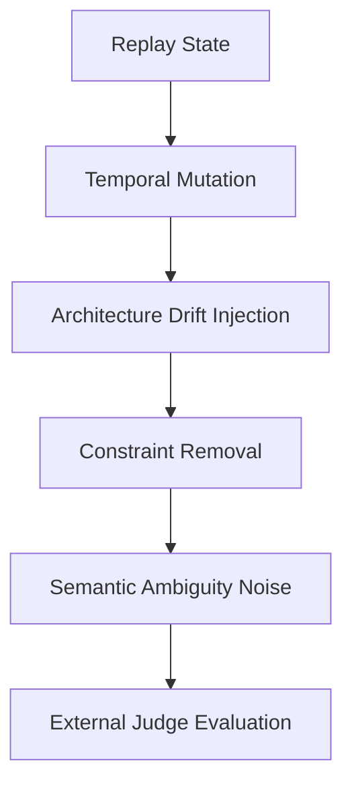

The adversarial suite is intentionally hostile. It includes context fragmentation, dependency inversion, temporal mutation, architecture drift injection, contradictory goal injection, hidden constraint removal, semantic ambiguity noise, replay truncation, partial reconstruction, and recursive recompression.

---

## Mermaid: comparative evaluation

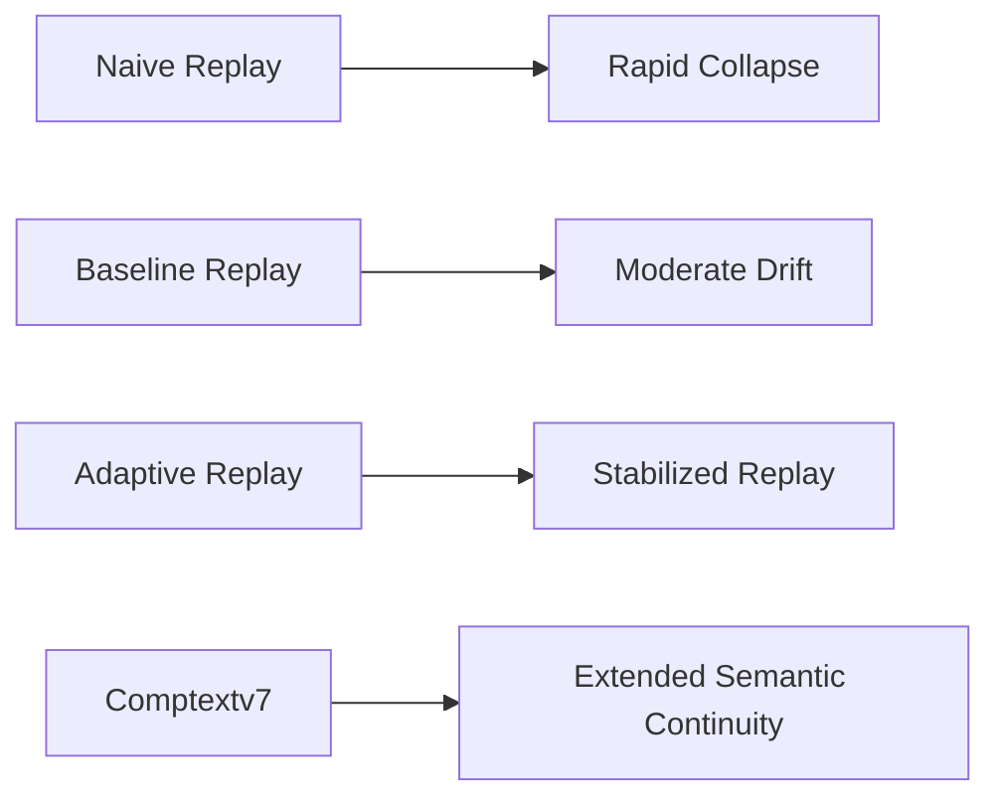

This comparison is not a token benchmark. It asks whether replay systems preserve enough operational state to keep a task coherent after repeated adversarial replay.

---

## Real adversarial results

The current committed replay-continuity artifact was generated with:

```bash
python benchmarks/run_replay_continuity.py --iterations 250 --output-dir reports/replay_continuity
```

The benchmark purpose is explicitly a strict adversarial semantic/operational replay continuity evaluation, not a token benchmark. The evaluator stack includes replay generation, external replay judges, and comparative analysis.

### Long-horizon adversarial results

Mean final continuity at each iteration ladder:

| System | Iteration 25 | Iteration 50 | Iteration 100 | Iteration 250 |
| --- | ---: | ---: | ---: | ---: |
| Naive Replay | 0.039 | 0.039 | 0.043 | 0.039 |
| Baseline Replay | 0.294 | 0.294 | 0.294 | 0.294 |
| Adaptive Replay | 0.679 | 0.476 | 0.302 | 0.302 |
| Comptextv7 | 1.000 | 0.995 | 0.824 | 0.572 |

> Note: a previous 0.824 Comptextv7 checkpoint corresponds to the 100-iteration ladder in the current evaluator. The committed 250-iteration report records 0.571783 mean final continuity, so this README uses 0.572 for the 250-iteration result.

### Replay longevity

| System | Approx replay longevity / collapse point |
| --- | ---: |
| Naive Replay | ~1 iteration |
| Baseline Replay | ~10 iterations |
| Adaptive Replay | ~45 iterations |
| Comptextv7 | censored at ~250 iterations in this suite |

Interpretation:

- **Comptextv7 did not cross the collapse threshold during the 250-iteration run**, so its reported collapse point is censored at 250 rather than proof of indefinite persistence.
- **Detail fidelity still degrades.** At iteration 250, the report records hidden truth survival at 0.570173 and final continuity at 0.571783.
- **Evaluator divergence remains material.** The 250-iteration run reports Comptextv7 evaluator divergence at 0.421743, which means the judges still disagree enough to require caution.
- **Continuity definitions are experimental.** Current scores are useful for comparing systems inside this deterministic suite, not for claiming universal memory quality.

---

## Visualization

The repository commits deterministic SVG artifacts for review. These charts are intended to make replay degradation visible rather than hiding collapse behind aggregate claims.

| Continuity degradation | Replay half-life / longevity |
| --- | --- |
| 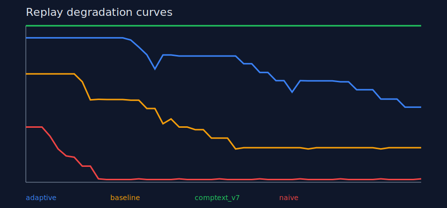 | 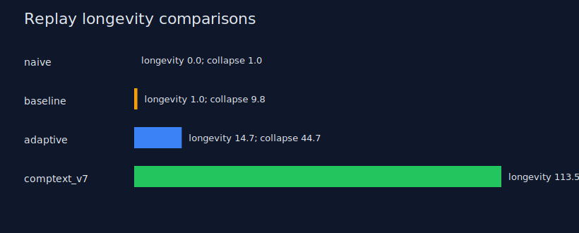 |

| Adversarial drift | Replay collapse curves |
| --- | --- |
| 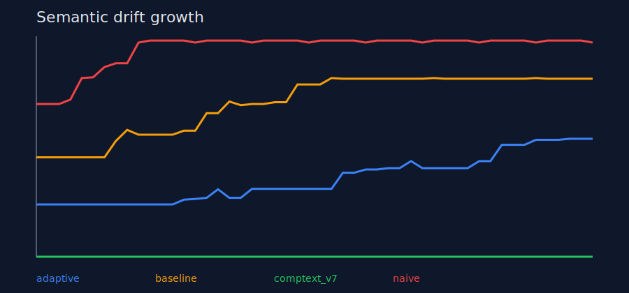 | 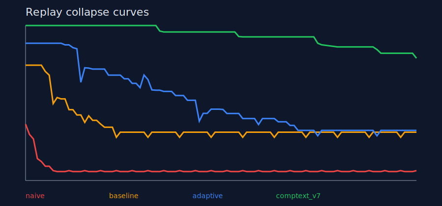 |

| Evaluator divergence | Hidden constraint survival |
| --- | --- |
| 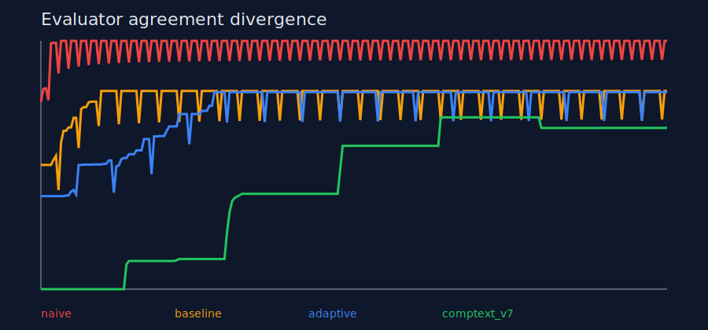 | 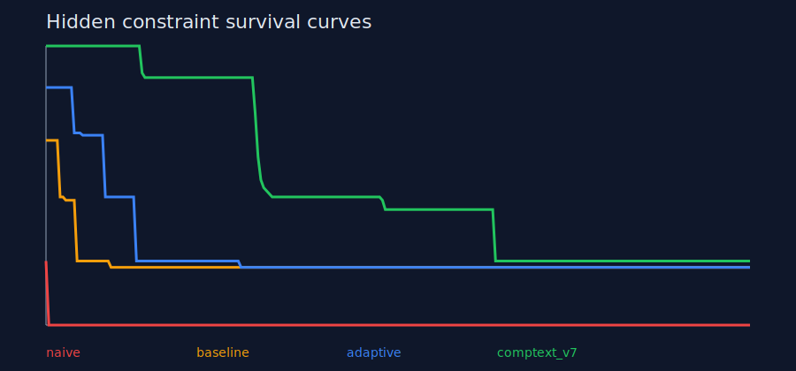 |

Additional artifacts include architecture mutation timelines, contradiction accumulation heatmaps, temporal consistency degradation, semantic stability heatmaps, and failure-point timelines under `reports/replay_continuity/`.

---

## Important limitations

This section is part of the project’s credibility, not a footnote.

- **Replay continuity is not perfect memory.** A high continuity score means the state remains operationally usable under this evaluator; it does not mean every source detail survived.
- **Detail fidelity degrades.** Long-horizon replay loses hidden truths and fine-grained context even when the overall state remains more coherent than baselines.
- **Evaluator leakage risks still exist.** Deterministic synthetic suites can accidentally encode assumptions that help the system under test.
- **Semantic judges are still evolving.** Heuristic, embedding, entailment, contradiction, temporal, architecture, and hidden-truth judges are useful but imperfect.
- **Adversarial validation is incomplete.** The current attack families are broad, but they do not represent every operational workflow, domain, or failure mode.
- **Current continuity metrics are experimental.** They are comparative research metrics, not production guarantees.
- **Synthetic data is not production fidelity.** Public fixtures are synthetic/static by design; real deployment would require controlled validation on approved enterprise datasets.
- **No vendor certification or production integration is claimed.** The project does not claim Daimler certification, fleet telemetry access, or proprietary-data integration.

---

## Why this matters

If replay state can degrade more gracefully, it becomes relevant to systems that must continue work beyond a single context window:

- autonomous coding agents that need to preserve architecture decisions, blockers, and reviewer constraints;
- long-running copilots that must resume workflows without silently rewriting task history;
- persistent workflow agents that hand off state between sessions, tools, and operators;
- semantic memory systems that need more than generic summarization;
- enterprise operational assistants that must preserve audit-sensitive constraints and chronology;
- AI systems operating under limited context windows, high token costs, or repeated summarization pressure.

The goal is not to make agents omniscient. The goal is to measure and improve whether replayed operational state remains trustworthy enough to continue work.

---

## Research direction

Near-term research work focuses on stronger external validation and more precise failure visibility:

| Area | Direction |
| --- | --- |
| External evaluator models | Add independent model-based and rules-based judges with transparent disagreement reporting. |
| Semantic entailment judges | Measure whether reconstructed states still entail the original constraints and truths. |
| Embedding divergence analysis | Track semantic distance across replay iterations and attack families. |
| Hidden truth verification | Stress test facts that are easy to omit but operationally critical. |
| State-based semantic persistence | Improve replay states as structured objects rather than prose-only summaries. |
| Graph-based operational memory | Preserve owners, dependencies, architecture nodes, temporal edges, and blocked states as graph structure. |
| Long-horizon replay survival | Extend iteration ladders while reporting degradation, collapse, and evaluator uncertainty honestly. |

Positioning statement:

> Comptextv7 is an experimental semantic continuity research framework exploring whether structured semantic replay states degrade more gracefully than traditional replay compression systems.

It is **not** a solved AI-memory system.

---

## Reproducibility

### Primary replay-continuity benchmark

```bash
python -m pip install -e ".[test]"
python benchmarks/run_replay_continuity.py --iterations 250 --output-dir reports/replay_continuity
python -m pytest tests/test_replay_continuity.py
```

### General validation commands

```bash
python -m pytest
python scripts/validate.py replay
python scripts/validate.py token
python scripts/validate.py forensic
python benchmarks/run_kvtc_v7_benchmarks.py --iterations 1 --warmups 0
python dashboard/industrial_dashboard.py --once
```

Dashboard frontend checks:

```bash
cd dashboard/app
npm install
npm run typecheck
npm run build
npm run smoke:release-health
```

Agent/report tooling:

```bash
python scripts/repo_intake.py
python scripts/run_checks.py
python scripts/validate_contracts.py
python scripts/generate_contract_fixtures.py
python scripts/validate_api_exports.py
python scripts/generate_project_health_report.py
python scripts/generate_dashboard_health_summary.py
```

---

## Showcase and review surfaces

| Reviewer path | Link |
| --- | --- |
| Live showcase | <https://comptextv7.vercel.app> |
| No-local-execution demo script | [`docs/DEMO_WALKTHROUGH.md`](docs/DEMO_WALKTHROUGH.md) |
| Showcase readiness pack | [`docs/SHOWCASE_READINESS.md`](docs/SHOWCASE_READINESS.md) |
| Conservative benchmark explanation | [`docs/BENCHMARK_EXPLANATION.md`](docs/BENCHMARK_EXPLANATION.md) |
| Replay continuity report | [`reports/replay_continuity/validation_report.md`](reports/replay_continuity/validation_report.md) |
| Dashboard/API boundaries | [`docs/API_SURFACE.md`](docs/API_SURFACE.md) |

| Dashboard preview | Architecture preview |
| --- | --- |
| 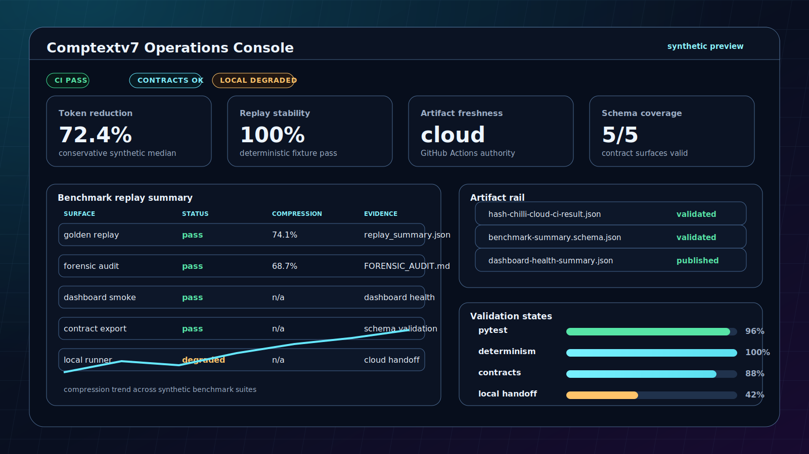 | 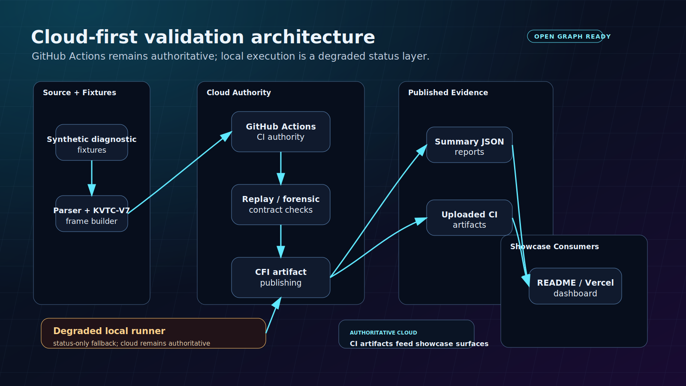 |

---

## Cloud-first validation architecture

Comptextv7 remains biased toward artifact-backed review rather than local machine trust.

| Workflow | Role |
| --- | --- |
| [`ci.yml`](.github/workflows/ci.yml) | Pytest, deterministic replay, token telemetry, semantic forensic validation, benchmark replay, and dashboard startup validation. |
| [`agent-checks.yml`](.github/workflows/agent-checks.yml) | Repository/report/contract checks plus dashboard typecheck, build, and release-health smoke coverage. |
| [`validation_runner.yml`](.github/workflows/validation_runner.yml) | Compact cloud validation result contract and artifact publishing. |

The Cloud Feedback Interface (CFI) artifact model keeps validation status small enough for dashboards, companion UIs, pull-request comments, and reviewer checklists.

| CFI item | Plain-English meaning | Primary evidence |
| --- | --- | --- |
| CFI-01 | A compact Cloud CI result contract exists for status metadata. | [`contracts/hash-chilli-cloud-ci-result.schema.json`](contracts/hash-chilli-cloud-ci-result.schema.json), [`docs/hash-companion/cloud-ci-result-contract.md`](docs/hash-companion/cloud-ci-result-contract.md) |
| CFI-02 | A GitHub Actions validation runner can produce authoritative cloud validation status. | [`.github/workflows/validation_runner.yml`](.github/workflows/validation_runner.yml), [`docs/hash-companion/validation-runner-workflow.md`](docs/hash-companion/validation-runner-workflow.md) |
| CFI-03 | The workflow publishes compact result artifacts for reviewer/companion consumption. | `validation-runner-cfi-artifacts`, `reports/hash-chilli-cloud-ci-result.json`, `reports/hash-chilli-cloud-ci-summary.json` |

---

## Repository map

```text
Comptextv7/
├── benchmarks/                 # deterministic compression, replay, and audit runners
├── contracts/                  # machine-readable handoff contracts
├── dashboard/                  # backend plus React operations console
├── datasets/golden/            # immutable synthetic replay fixtures
├── docs/                       # showcase, reports, wiki, and Hash/chilli docs
├── reports/replay_continuity/  # adversarial continuity metrics and SVG charts
├── scripts/                    # validation, reporting, and artifact tooling
├── src/                        # KVTC engine, audit, and semantic validation modules
├── tests/                      # Python regression and validation tests
└── README.md
```

---

## Safety boundaries

Do not commit:

- real Daimler payloads or proprietary customer data;
- secrets, API keys, tokens, cookies, or credentials;
- raw production logs;
- unsanitized replay fixtures;
- private deployment credentials or environment dumps.

Comptextv7 is a deterministic, synthetic-only research prototype for semantic continuity, operational replay persistence, and reviewable diagnostic infrastructure. It is not a production fleet telemetry system, does not claim vendor certification or affiliation, and does not claim solved AI memory.
