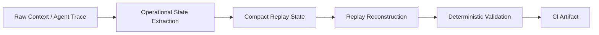

# Comptextv7

Deterministic operational replay validation for long-horizon AI agents.

Comptextv7 validates whether compact, replay-safe operational state can preserve
workflow continuity across compression, reconstruction, and CI-audited checks.
It focuses on auditable replay behavior, not marketing claims or live model judgment.

[](pyproject.toml)
[](https://github.com/ProfRandom92/Comptextv7/actions/workflows/ci.yml)


## 30-second summary

Comptextv7 is:

- deterministic replay validation infrastructure;
- focused on operational state, not raw chat history;
- backed by CI-published JSON artifacts;
- currently validated on paper replay and agent trace replay fixtures.

## Benchmark snapshot

Values below are read from committed deterministic artifacts only:
[`artifacts/paper_replay_results.json`](artifacts/paper_replay_results.json) and
[`artifacts/agent_trace_replay_results.json`](artifacts/agent_trace_replay_results.json).

| Benchmark | Count | Avg compression ratio | Replay consistency | Operational drift |
| --- | ---: | ---: | ---: | ---: |
| Paper Replay Benchmark | 3 papers | 1.347063 | 0.791667 | Not reported |
| Agent Trace Replay Benchmark | 3 traces | 1.773954 | 1.000000 | 0.000000 |

How to read this:

- Paper replay shows lossy operational-state compression under dense technical text.
- Agent trace replay currently shows near-lossless structured workflow replay
  because compact state preserves typed workflow fields.
- `1.000` replay consistency in the agent trace benchmark indicates exact
  preservation under the current structured trace fixture setup; it is not a
  claim of complete long-term recall.
- The next validation target is stronger iterative replay degradation pressure.

## What exists now

| Capability | Status |
| --- | --- |
| Paper Replay Benchmark | Implemented |
| Agent Trace Replay Benchmark | Implemented |
| Deterministic Replay Metrics | Implemented |
| CI Artifact Publishing | Implemented |
| No LLM Judging | Enforced |
| No Embeddings / Vector DB | Enforced |

## Architecture



| Stage | What it preserves or tests |
| --- | --- |
| Raw context / trace | Goals, constraints, blockers, chronology, dependencies, and tool sequence. |
| Operational state extraction | Converts source context into compact replay-safe structure. |
| Compact replay state | Stores the minimum state expected to support reconstruction. |
| Replay reconstruction | Rebuilds task context from the compact state. |
| Deterministic validation | Scores continuity, drift, survival, and replay consistency. |
| CI artifact | Publishes JSON evidence for review and audit. |

## Benchmark family

### Paper Replay Benchmark

Dense paper excerpts are converted into operational extraction records, compressed
into compact replay state, reconstructed, and scored with deterministic survival
metrics. The benchmark stresses lossy preservation of entities, metrics,
sections, and limitations under dense technical prose.

- Method: [`docs/benchmarks/paper_replay.md`](docs/benchmarks/paper_replay.md)
- Artifact: [`artifacts/paper_replay_results.json`](artifacts/paper_replay_results.json)

### Agent Trace Replay Benchmark

Multi-step agent traces are reduced to typed workflow state: active task,
constraints, dependencies, blockers, and tool sequence. Replay validation checks
whether those operational fields survive compact state reconstruction.

- Method: [`docs/benchmarks/agent_trace_replay.md`](docs/benchmarks/agent_trace_replay.md)
- Artifact: [`artifacts/agent_trace_replay_results.json`](artifacts/agent_trace_replay_results.json)

## Replay collapse problem

Long-running agents can fail because replayed context becomes operationally
untrustworthy before compute runs out. Compression can preserve fluent text while
losing blockers, chronology, owners, constraints, or why a decision mattered.

| Failure mode | Operational impact |
| --- | --- |
| Replay collapse | The system can no longer continue the original task safely. |
| Context fragmentation | Decisions, constraints, and owners separate from governed work. |
| Operational forgetting | The agent forgets what must not change. |
| Semantic degradation | The replay looks plausible but no longer entails the source state. |
| Recursive recompression | Each replay cycle amplifies prior omissions and distortions. |

Comptextv7 tests whether explicit operational state survives compression,
reconstruction, and adversarial replay better than naive or baseline replay.

## Long-horizon adversarial replay

This older/parallel continuity stress suite is complementary to the newer
artifact-backed paper and agent-trace benchmarks. It measures mean final
continuity under adversarial replay ladders, not token compression alone.

| System | Iteration 25 | Iteration 50 | Iteration 100 | Iteration 250 |
| --- | ---: | ---: | ---: | ---: |
| Naive Replay | 0.039 | 0.039 | 0.043 | 0.039 |
| Baseline Replay | 0.294 | 0.294 | 0.294 | 0.294 |
| Adaptive Replay | 0.679 | 0.476 | 0.302 | 0.302 |
| Comptextv7 | 1.000 | 0.995 | 0.824 | 0.572 |

The 250-iteration report records Comptextv7 mean final continuity at `0.571783`;
the table rounds it to `0.572`.

### Replay longevity

| System | Approx replay longevity / collapse point |
| --- | ---: |
| Naive Replay | ~1 iteration |
| Baseline Replay | ~10 iterations |
| Adaptive Replay | ~45 iterations |
| Comptextv7 | censored at ~250 iterations in this suite |

Comptextv7 did not cross the collapse threshold during the 250-iteration run, so
the result is censored at 250 rather than evidence of indefinite persistence.

## Visual artifacts

Deterministic SVG reports are committed for inspection without decorative header
images or broken previews.

- [`replay_degradation_curves.svg`](reports/replay_continuity/replay_degradation_curves.svg)
- [`continuity_half_life_chart.svg`](reports/replay_continuity/continuity_half_life_chart.svg)
- [`semantic_drift_graph.svg`](reports/replay_continuity/semantic_drift_graph.svg)
- [`replay_collapse_curves.svg`](reports/replay_continuity/replay_collapse_curves.svg)
- [`evaluator_agreement_divergence.svg`](reports/replay_continuity/evaluator_agreement_divergence.svg)
- [`hidden_constraint_survival_curves.svg`](reports/replay_continuity/hidden_constraint_survival_curves.svg)

## Integrity model

Comptextv7 is designed for replay checks that can be inspected without trusting a
live model call or opaque vector store.

- **No LLM judging:** replay quality is scored by deterministic benchmark code,
  not model preference calls.
- **No embeddings:** validation does not depend on vector similarity, embedding
  APIs, or vector databases.
- **No external APIs:** committed fixtures and local code produce replay artifacts.
- **Deterministic JSON artifacts:** outputs are serialized for review, diffing,
  and CI artifact publication.
- **CI reproducible:** GitHub Actions run validation paths and publish
  machine-readable evidence.
- **Audit friendly:** metrics, fixture counts, and replay outputs remain
  inspectable in the repository.

## Important limitations

- Current benchmarks use curated synthetic/static fixtures, not broad production
  traffic.
- Agent trace replay is currently near-lossless because fixtures are structured.
- Stronger iterative degradation pressure is still pending for the newer fixture
  benchmarks.
- This is not a general long-term recall system, autonomous agent framework, or
  production telemetry system.
- Detail fidelity still degrades; at 250 iterations, hidden truth survival is
  `0.570173`.
- Evaluator divergence remains material; Comptextv7 divergence is `0.421743` at
  250 iterations.
- Current continuity metrics are comparative research metrics, not production
  guarantees.
- No vendor certification or proprietary-data integration is claimed.

## Why this matters

Replay-safe operational state is relevant to systems that must continue work
beyond a single context window:

- coding agents preserving architecture decisions, blockers, and reviewer
  constraints;
- long-running copilots resuming workflows without rewriting task history;
- persistent workflow agents handing off state between sessions, tools, and
  operators;
- enterprise assistants preserving audit-sensitive constraints and chronology.

The goal is to measure whether replayed operational state remains trustworthy
enough to continue work.

## Research direction

| Area | Next step |
| --- | --- |
| Iterative degradation | Extend replay ladders and report degradation curves, not just endpoints. |
| Entailment checks | Verify reconstructed states still entail original constraints and truths. |
| Hidden truth verification | Stress test facts that are easy to omit but operationally critical. |
| Graph operational state | Preserve owners, dependencies, architecture nodes, temporal edges, and blockers. |
| External validation | Add independent judges with transparent disagreement reporting. |
| Trace coverage | Expand approved real-world-style traces while preserving privacy boundaries. |

## Showcase and review surfaces

| Reviewer path | Link |
| --- | --- |
| Live showcase | <https://comptextv7.vercel.app> |
| No-local-execution demo script | [`docs/DEMO_WALKTHROUGH.md`](docs/DEMO_WALKTHROUGH.md) |
| Showcase readiness pack | [`docs/SHOWCASE_READINESS.md`](docs/SHOWCASE_READINESS.md) |
| Conservative benchmark explanation | [`docs/BENCHMARK_EXPLANATION.md`](docs/BENCHMARK_EXPLANATION.md) |
| Replay continuity report | [`reports/replay_continuity/validation_report.md`](reports/replay_continuity/validation_report.md) |
| Dashboard/API boundaries | [`docs/API_SURFACE.md`](docs/API_SURFACE.md) |

## Cloud-first validation

Comptextv7 remains biased toward artifact-backed review rather than local machine
trust.

| Workflow | Role |
| --- | --- |
| [`ci.yml`](.github/workflows/ci.yml) | Pytest, deterministic replay, token telemetry, benchmark replay, and dashboard startup validation. |
| [`agent-checks.yml`](.github/workflows/agent-checks.yml) | Repository/report/contract checks plus dashboard typecheck, build, and smoke coverage. |
| [`validation_runner.yml`](.github/workflows/validation_runner.yml) | Compact cloud validation result contract and artifact publishing. |

The Cloud Feedback Interface (CFI) model publishes compact validation status for
dashboards, companion UIs, pull-request comments, and reviewer checklists.

## Reproducibility

```bash
python -m pip install -e ".[test]"
python -m pytest
python scripts/validate.py replay
python benchmarks/run_replay_continuity.py --iterations 250 --output-dir reports/replay_continuity
```
