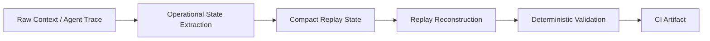

# Comptextv7

Deterministic operational memory for long-horizon AI agents.

Comptextv7 validates whether compact replay-safe operational state can preserve workflow continuity across compression, reconstruction, and CI-audited replay checks.

[](pyproject.toml)
[](https://github.com/ProfRandom92/Comptextv7/actions/workflows/ci.yml)


## Benchmark snapshot

Values below are read from committed deterministic artifacts only: [`artifacts/paper_replay_results.json`](artifacts/paper_replay_results.json) and [`artifacts/agent_trace_replay_results.json`](artifacts/agent_trace_replay_results.json).

| Benchmark | Count | Avg compression ratio | Replay consistency | Operational drift |
| --- | ---: | ---: | ---: | ---: |
| Paper Replay Benchmark | 3 papers | 1.347063 | 0.791667 | Not reported |
| Agent Trace Replay Benchmark | 3 traces | 1.773954 | 1.000000 | 0.000000 |

## What exists now

| Capability | Status |
| --- | --- |
| Paper Replay Benchmark | Implemented |
| Agent Trace Replay Benchmark | Implemented |
| Deterministic Replay Metrics | Implemented |
| CI Artifact Publishing | Implemented |
| No LLM Judging | Enforced |
| No Embeddings / Vector DB | Enforced |

## Replay collapse problem

Long-running agents often fail because replayed context becomes operationally untrustworthy before compute runs out. Compression can preserve fluent text while losing blockers, chronology, owners, constraints, or the reason a decision mattered.

| Failure mode | Operational impact |
| --- | --- |
| Replay collapse | The system can no longer continue the original task safely. |
| Context fragmentation | Decisions, constraints, and owners separate from the work they govern. |
| Operational forgetting | The agent forgets what must not change, not just what should be done. |
| Semantic degradation | The replay looks plausible but no longer entails the original state. |
| Recursive recompression | Each replay cycle amplifies prior omissions and distortions. |

Comptextv7 tests whether explicit operational state can survive compression, reconstruction, and adversarial replay better than naive or baseline replay methods.

## Architecture



| Stage | What it preserves or tests |
| --- | --- |
| Raw context / trace | Goals, constraints, blockers, chronology, dependencies, and tool sequence. |
| Operational state extraction | Converts source context into compact replay-safe structure. |
| Compact replay state | Stores the minimum state expected to support reconstruction. |
| Replay reconstruction | Rebuilds task context from the compact state. |
| Deterministic validation | Scores continuity, drift, survival, and replay consistency. |
| CI artifact | Publishes JSON evidence for review and audit. |

## Long-horizon adversarial replay

The replay-continuity suite is a hostile semantic/operational evaluation, not a token benchmark. The committed report was generated with:

```bash
python benchmarks/run_replay_continuity.py --iterations 250 --output-dir reports/replay_continuity
```

Mean final continuity at each iteration ladder:

| System | Iteration 25 | Iteration 50 | Iteration 100 | Iteration 250 |
| --- | ---: | ---: | ---: | ---: |
| Naive Replay | 0.039 | 0.039 | 0.043 | 0.039 |
| Baseline Replay | 0.294 | 0.294 | 0.294 | 0.294 |
| Adaptive Replay | 0.679 | 0.476 | 0.302 | 0.302 |
| Comptextv7 | 1.000 | 0.995 | 0.824 | 0.572 |

The 250-iteration report records Comptextv7 mean final continuity at `0.571783`; the table rounds it to `0.572`.

### Replay longevity

| System | Approx replay longevity / collapse point |
| --- | ---: |
| Naive Replay | ~1 iteration |
| Baseline Replay | ~10 iterations |
| Adaptive Replay | ~45 iterations |
| Comptextv7 | censored at ~250 iterations in this suite |

Comptextv7 did not cross the collapse threshold during the 250-iteration run, so the result is censored at 250 rather than evidence of indefinite persistence.

## Visualization artifacts

The repository commits deterministic SVG reports for visual inspection without restoring header graphics or broken previews.

| Artifact | Link |
| --- | --- |
| Continuity degradation | [`reports/replay_continuity/replay_degradation_curves.svg`](reports/replay_continuity/replay_degradation_curves.svg) |
| Replay half-life / longevity | [`reports/replay_continuity/continuity_half_life_chart.svg`](reports/replay_continuity/continuity_half_life_chart.svg) |
| Adversarial drift | [`reports/replay_continuity/semantic_drift_graph.svg`](reports/replay_continuity/semantic_drift_graph.svg) |
| Replay collapse curves | [`reports/replay_continuity/replay_collapse_curves.svg`](reports/replay_continuity/replay_collapse_curves.svg) |
| Evaluator divergence | [`reports/replay_continuity/evaluator_agreement_divergence.svg`](reports/replay_continuity/evaluator_agreement_divergence.svg) |
| Hidden constraint survival | [`reports/replay_continuity/hidden_constraint_survival_curves.svg`](reports/replay_continuity/hidden_constraint_survival_curves.svg) |

## Integrity model

Comptextv7 is designed for replay checks that can be inspected without trusting a live model call or opaque vector store.

- **No LLM judging:** replay quality is scored by deterministic benchmark code, not model preference calls.
- **No embeddings:** validation does not depend on vector similarity, embedding APIs, or vector databases.
- **No external APIs:** committed fixtures and local code produce replay artifacts.
- **Deterministic JSON artifacts:** outputs are serialized for review, diffing, and CI artifact publication.
- **CI reproducible:** GitHub Actions run validation paths and publish machine-readable evidence.
- **Audit friendly:** metrics, fixture counts, and replay outputs remain inspectable in the repository.

## Important limitations

- Current benchmarks use curated synthetic/static fixtures, not broad production traffic.
- This is not solved AI memory and does not claim general long-term recall.
- This is not an autonomous agent framework or production telemetry system.
- Detail fidelity still degrades; at 250 iterations, hidden truth survival is `0.570173`.
- Evaluator divergence remains material; Comptextv7 divergence is `0.421743` at 250 iterations.
- Current continuity metrics are comparative research metrics, not production guarantees.
- Iterative replay degradation and real-world trace coverage are active next steps.
- No vendor certification, proprietary-data integration, or AGI claim is made.

## Why this matters

Replay-safe operational state is relevant to systems that must continue work beyond a single context window:

- coding agents that need to preserve architecture decisions, blockers, and reviewer constraints;
- long-running copilots that must resume workflows without silently rewriting task history;
- persistent workflow agents that hand off state between sessions, tools, and operators;
- enterprise assistants that must preserve audit-sensitive constraints and chronology.

The goal is not omniscient memory. The goal is to measure whether replayed operational state remains trustworthy enough to continue work.

## Research direction

| Area | Next step |
| --- | --- |
| Iterative replay degradation | Extend replay ladders and report degradation curves, not just endpoints. |
| Entailment checks | Verify reconstructed states still entail original constraints and truths. |
| Hidden truth verification | Stress test facts that are easy to omit but operationally critical. |
| Graph-based operational memory | Preserve owners, dependencies, architecture nodes, temporal edges, and blocked states. |
| External validation | Add independent rules-based/model-based judges with transparent disagreement reporting. |
| Trace coverage | Expand approved real-world-style traces while preserving privacy boundaries. |

## Showcase and review surfaces

| Reviewer path | Link |
| --- | --- |
| Live showcase | <https://comptextv7.vercel.app> |
| No-local-execution demo script | [`docs/DEMO_WALKTHROUGH.md`](docs/DEMO_WALKTHROUGH.md) |
| Showcase readiness pack | [`docs/SHOWCASE_READINESS.md`](docs/SHOWCASE_READINESS.md) |
| Conservative benchmark explanation | [`docs/BENCHMARK_EXPLANATION.md`](docs/BENCHMARK_EXPLANATION.md) |
| Replay continuity report | [`reports/replay_continuity/validation_report.md`](reports/replay_continuity/validation_report.md) |
| Dashboard/API boundaries | [`docs/API_SURFACE.md`](docs/API_SURFACE.md) |

## Cloud-first validation architecture

Comptextv7 remains biased toward artifact-backed review rather than local machine trust.

| Workflow | Role |
| --- | --- |
| [`ci.yml`](.github/workflows/ci.yml) | Pytest, deterministic replay, token telemetry, semantic forensic validation, benchmark replay, and dashboard startup validation. |
| [`agent-checks.yml`](.github/workflows/agent-checks.yml) | Repository/report/contract checks plus dashboard typecheck, build, and release-health smoke coverage. |
| [`validation_runner.yml`](.github/workflows/validation_runner.yml) | Compact cloud validation result contract and artifact publishing. |

The Cloud Feedback Interface (CFI) model publishes compact validation status for dashboards, companion UIs, pull-request comments, and reviewer checklists.

## Reproducibility

```bash
python -m pip install -e ".[test]"
python -m pytest
python scripts/validate.py replay
python benchmarks/run_replay_continuity.py --iterations 250 --output-dir reports/replay_continuity
```
