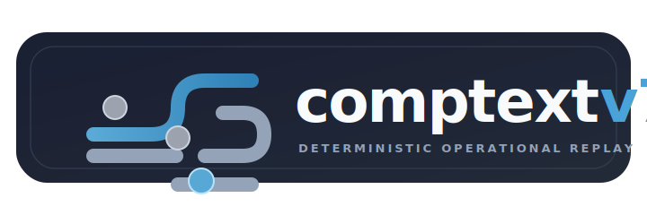
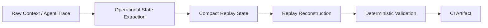

<p align="center">
  
</p>

<h1 align="center">Comptextv7</h1>

<p align="center">
  <strong>Deterministic operational replay validation for long-horizon AI agents.</strong>
</p>

<p align="center">
  Comptextv7 is a deterministic operational replay-validation and state-survivability prototype: it tests whether compact, replay-safe operational state preserves fixture-defined evidence, constraints, blockers, dependencies, recovery paths, and tool-order signals across compression, reconstruction, iterative replay degradation, and CI-audited summaries — without LLM judges, embeddings, vector databases, graph stores, or external APIs.
  <br/><br/>
  See <a href="docs/research_positioning.md">docs/research_positioning.md</a> for conservative project positioning and scope boundaries.
</p>

<p align="center">
  <a href="https://github.com/ProfRandom92/Comptextv7/actions/workflows/ci.yml"></a>
  
  
  
  
  
</p>

<p align="center">
  <a href="https://comptextv7.vercel.app"><strong>Live showcase</strong></a>
  · <a href="docs/DEMO_WALKTHROUGH.md">Demo walkthrough</a>
  · <a href="docs/BENCHMARK_EXPLANATION.md">Benchmark explanation</a>
  · <a href="reports/replay_continuity/validation_report.md">Replay report</a>
</p>

---


## Safe Positioning

Comptextv7 is a deterministic operational replay-validation and state-survivability prototype. It validates whether compact operational state preserves fixture-defined evidence, constraints, blockers, dependencies, recovery paths, and tool-order signals through compression, replay, and bounded iterative degradation. It is complementary to learned context-compression research, RAG evaluation, vector-memory systems, serving-layer cache optimization, and durable workflow infrastructure, but it is not a workflow orchestrator, learned compressor, vector memory system, RAG replacement, KV-cache compressor, or universal AI-memory solution.

For detailed positioning, see [Research Positioning](docs/research_positioning.md) and [Research Positioning Sources](docs/research_positioning_sources.md).


## Why this exists

Long-running agents fail when replayed context becomes operationally untrustworthy:

- constraints disappear;
- blockers detach from tasks;
- tool sequences mutate;
- dependencies collapse;
- summaries sound fluent but lose actionable state.

Comptextv7 focuses on preserving the operational state needed to continue work, not preserving raw chat history.
The project treats replay as an auditable operational-state problem: extract the fields that matter, compact them, reconstruct them, and verify them with deterministic checks.

## Proof at a glance

| Evidence | Current result |
|---|---:|
| Paper replay fixtures | 3 dense technical papers |
| Agent trace fixtures | 3 multi-step workflows |
| Paper avg compression | 1.347063 |
| Agent avg compression | 1.773954 |
| Paper replay consistency | 0.791667 |
| Agent replay consistency | 1.000000 |
| Agent operational drift | 0.000000 |
| Evaluation mode | deterministic, no LLM judging |
| Artifact format | committed JSON + CI upload |

Sources: [`artifacts/paper_replay_results.json`](artifacts/paper_replay_results.json) and [`artifacts/agent_trace_replay_results.json`](artifacts/agent_trace_replay_results.json).

## How to read these values

- **Paper replay is lossy under dense technical prose.** The current paper fixtures include entities, limitations, sections, and metrics that are harder to preserve after compaction.
- **Agent trace replay is currently near-lossless because traces are structured.** The checked-in traces expose explicit tasks, blockers, dependencies, tool order, and recovery actions.
- **`1.000000` replay consistency does not mean solved memory.** It means exact preservation under the current structured trace fixtures and current deterministic validator.
- **Operational drift is field loss, not subjective quality.** A non-zero drift rate would mean replay lost required operational fields.
- **Iterative replay degradation is now a bounded prototype.** Repeated compact/replay cycles emit deterministic JSON and Markdown artifacts for reviewing drift curves, collapse points, and failure labels. A small fixture-bound comparison mode now contrasts `CONSERVATIVE`, `BALANCED`, and `AGGRESSIVE` compression profiles with deterministic per-profile aggregates.

## What makes this different

- Not chat-history storage.
- Not vector memory.
- Not model-judged summarization.
- Not autonomous agent orchestration.
- Deterministic operational-state replay validation.

## Architecture



Comptextv7 turns noisy context into compact operational state, then validates whether replay reconstructs the fields needed to continue work.

## Benchmark family

### Paper Replay Benchmark

- **Validates:** whether dense technical paper summaries preserve entities, metrics, limitations, and section structure after deterministic replay compression.
- **Artifact:** [`artifacts/paper_replay_results.json`](artifacts/paper_replay_results.json).
- **Method:** [`docs/benchmarks/paper_replay.md`](docs/benchmarks/paper_replay.md).
- **Current avg compression:** `1.347063`.
- **Current replay consistency:** `0.791667`.

### Agent Trace Replay Benchmark

- **Validates:** whether multi-step agent workflows preserve active tasks, constraints, dependencies, tool sequences, unresolved blockers, deployment requirements, and recovery actions.
- **Artifact:** [`artifacts/agent_trace_replay_results.json`](artifacts/agent_trace_replay_results.json).
- **Method:** [`docs/benchmarks/agent_trace_replay.md`](docs/benchmarks/agent_trace_replay.md).
- **Current avg compression:** `1.773954`.
- **Current replay consistency:** `1.000000`.
- **Operational drift:** `0.000000`.
- **Interpretation:** current setup is near-lossless because the fixtures are structured; this is a useful baseline, not a universal memory claim.

### Iterative Replay Degradation Prototype

- **Validates:** how checked-in paper and agent-trace fixtures degrade across bounded repeated compact/replay cycles.
- **Method:** [`docs/iterative_replay_degradation.md`](docs/iterative_replay_degradation.md).
- **Profile comparison:** additive prototype mode compares `CONSERVATIVE`, `BALANCED`, and `AGGRESSIVE` compression profiles using fixture-bound aggregates only: collapse rate, replay consistency, operational drift, evidence survival, and deterministic failure labels.
- **Current internal baseline:** see the fixture-bound [comparative replay degradation results](docs/iterative_replay_degradation.md#comparative-replay-degradation-results).
- **Interpretation:** profile comparison rows are deterministic replay-validation observations for the current fixtures, not general memory, production, or clinical-grade claims.

## Complementary adversarial replay stress suite

This suite is a separate long-horizon stress surface under `reports/replay_continuity/`.
It remains useful context, but the focused README narrative is the deterministic operational replay benchmark family above.

| System | Iteration 25 | Iteration 50 | Iteration 100 | Iteration 250 |
| --- | ---: | ---: | ---: | ---: |
| Naive | 0.039 | 0.039 | 0.043 | 0.039 |
| Baseline | 0.294 | 0.294 | 0.294 | 0.294 |
| Adaptive | 0.679 | 0.476 | 0.302 | 0.302 |
| Comptextv7 | 1.000 | 0.995 | 0.824 | 0.572 |

The committed 250-iteration report records Comptextv7 mean final continuity at `0.571783`, rounded to `0.572` here.
Detail fidelity still degrades: hidden truth survival is `0.570173`, and evaluator agreement divergence is `0.421743`.

| System | Approx collapse point |
| --- | ---: |
| Naive | ~1 iteration |
| Baseline | ~10 iterations |
| Adaptive | ~45 iterations |
| Comptextv7 | censored at ~250 iterations in this suite |

## Visual artifacts

- [`replay_degradation_curves.svg`](reports/replay_continuity/replay_degradation_curves.svg)
- [`continuity_half_life_chart.svg`](reports/replay_continuity/continuity_half_life_chart.svg)
- [`semantic_drift_graph.svg`](reports/replay_continuity/semantic_drift_graph.svg)
- [`replay_collapse_curves.svg`](reports/replay_continuity/replay_collapse_curves.svg)
- [`evaluator_agreement_divergence.svg`](reports/replay_continuity/evaluator_agreement_divergence.svg)
- [`hidden_constraint_survival_curves.svg`](reports/replay_continuity/hidden_constraint_survival_curves.svg)

## Integrity model

- **no LLM judging**;
- **no embeddings**;
- **no vector DBs**;
- **no external APIs**;
- **artifact-backed JSON + CI checks**;
- **deterministic hashing foundation** ([`docs/deterministic_hashing.md`](docs/deterministic_hashing.md));
- **audit-friendly and CI reproducible**.

### Foundational Components

The system relies on the following deterministic foundations:
- **`ReferenceIndex`** and **`EventLogArtifactAdapter`**: track context references and deterministically fingerprint event payloads ([`docs/reference_index_event_fingerprints.md`](docs/reference_index_event_fingerprints.md)).
- **`ReplayArtifactWriter v1-alpha.1`**: generates deterministic, standalone JSON artifacts for verifiable snapshots ([`docs/replay_artifact_writer.md`](docs/replay_artifact_writer.md)).

## Limitations

- Metrics mentioned in benchmarks are **fixture-bound baselines** and do not reflect real-world universal correctness.
- Fixtures are curated and checked in.
- Structured agent traces currently replay near-losslessly.
- This is not solved AI memory.
- This is not production telemetry.
- This is not an autonomous agent framework.
- Evaluator divergence remains material in the long-horizon stress suite.
- Iterative degradation remains a bounded fixture prototype; its artifact and summary are review aids, not universal memory claims.

## Next technical milestone

> Next: continue tightening deterministic replay review surfaces.
> Keep repeated compact/replay artifacts cheap, deterministic, additive-compatible, and easy to inspect in CI and pull requests.

## Validated deterministic replay review flow

Use this short flow when reviewing replay-system changes:

1. Regenerate or inspect deterministic replay artifacts only from checked-in fixtures.
2. Compare stable metric fields (`replay_consistency`, evidence survival rates, `operational_drift_rate`) and taxonomy fields (`failure_labels`, `failure_mode_counts`) rather than prose interpretations.
3. For iterative degradation review, run `python scripts/generate_iterative_replay_degradation_artifacts.py` and inspect both the JSON artifact and Markdown summary.
4. Treat additive artifact fields as forward-compatible when existing deterministic fields remain stable.
5. Keep claims fixture-bound: no LLM judging, embeddings, external APIs, production-readiness claims, or solved-memory claims.

## Review surfaces

| Surface | Link |
| --- | --- |
| Live showcase | [`comptextv7.vercel.app`](https://comptextv7.vercel.app) |
| CI Artifact Narrative | [`docs/ci_artifact_narrative.md`](docs/ci_artifact_narrative.md) |
| Demo walkthrough | [`docs/DEMO_WALKTHROUGH.md`](docs/DEMO_WALKTHROUGH.md) |
| Showcase readiness | [`docs/SHOWCASE_READINESS.md`](docs/SHOWCASE_READINESS.md) |
| Benchmark explanation | [`docs/BENCHMARK_EXPLANATION.md`](docs/BENCHMARK_EXPLANATION.md) |
| Replay failure taxonomy | [`docs/operational_replay_failure_taxonomy.md`](docs/operational_replay_failure_taxonomy.md) |
| Iterative replay degradation artifact and CI summary | [`docs/iterative_replay_degradation.md`](docs/iterative_replay_degradation.md) |
| Replay report | [`reports/replay_continuity/validation_report.md`](reports/replay_continuity/validation_report.md) |
| API surface | [`docs/API_SURFACE.md`](docs/API_SURFACE.md) |

## Repository map

```text
Comptextv7/
├── artifacts/                  # committed deterministic replay benchmark JSON
├── benchmarks/                 # deterministic compression, replay, and audit runners
├── contracts/                  # machine-readable validation and handoff contracts
├── dashboard/                  # backend plus React operations console
├── docs/                       # benchmark, showcase, and reviewer documentation
├── reports/replay_continuity/  # adversarial continuity metrics and SVG charts
├── scripts/                    # validation, reporting, and artifact tooling
├── showcase/app/               # Vite + TypeScript showcase application
├── src/                        # KVTC engine, audit, and semantic validation modules
├── tests/                      # Python regression and replay validation tests
└── README.md
```

## Safety boundaries
Do not commit:
- proprietary customer data;
- secrets, API keys, tokens, cookies, or credentials;
- raw production logs;
- unsanitized replay fixtures;
- private deployment credentials or environment dumps.

Comptextv7 is a deterministic, synthetic-only research prototype for operational replay persistence and reviewable diagnostic infrastructure.

## Cloud-first validation
Comptextv7 is biased toward artifact-backed review rather than local machine trust.

| Workflow | Role |
|---|---|
| [`ci.yml`](.github/workflows/ci.yml) | Runs deterministic replay, tests, telemetry, and validation gates. |
| [`agent-checks.yml`](.github/workflows/agent-checks.yml) | Runs repository/report/contract checks plus dashboard validation. |
| [`validation_runner.yml`](.github/workflows/validation_runner.yml) | Publishes compact cloud validation result artifacts. |

## Reproducibility
Install the Python test dependency set:

```bash
python -m pip install -e '.[test]'
```

Regenerate deterministic replay artifacts:

```bash
python tests/utils/paper_replay_runner.py
python tests/utils/agent_trace_replay_runner.py
python benchmarks/run_replay_continuity.py --iterations 250 --output-dir reports/replay_continuity
python scripts/generate_iterative_replay_degradation_artifacts.py
```

Use the validation commands in [`docs/validation.md`](docs/validation.md). The root `package.json` is a wrapper for reviewer convenience. App dependencies remain in `dashboard/app` and `showcase/app`.

Root wrapper checks:

```bash
npm run layout
npm run typecheck
npm run validate
npm run build
npm test
npm run check
```

Dashboard app checks:

```bash
cd dashboard/app
npm run typecheck
npm run build
```

Showcase app checks:

```bash
cd showcase/app
npm run typecheck
npm run validate
npm run build
```

Python checks from the repository root:

```bash
pytest -q
pytest tests/test_core_foundation_ts.py -q
pytest tests/test_paper_replay_bench.py tests/test_agent_trace_replay.py tests/test_replay_continuity.py -q
```

Additional repository validation helpers remain available when their surfaces are touched:

```bash
python scripts/validate.py replay
python scripts/validate.py token
python scripts/validate.py forensic
python scripts/validate_contracts.py
python scripts/validate_api_exports.py
```
