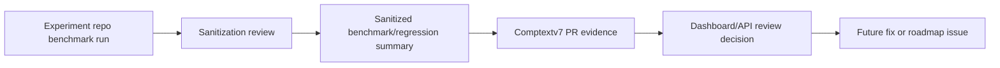

# Benchmark Integration

## Purpose

This document defines the lightweight integration layer between
`ProfRandom92/Comptextv7` and `ProfRandom92/Comptext-Daimler-Experiment-` for
benchmark reports, regression summaries, sanitization reports, and forensic
replay guidance.

The integration is documentation-first. Comptextv7 remains the main runtime,
dashboard, API, and review surface. The experiment repository remains the place
where benchmark/regression experiments can evolve independently. Comptextv7
should consume only reviewed, sanitized summaries and synthetic examples; it
should not import experiment repo code, raw payloads, proprietary documents,
customer data, cookies, tokens, or production logs.

## Repository roles

| Repository | Role | Integration boundary |
| --- | --- | --- |
| `ProfRandom92/Comptextv7` | Main KVTC runtime, dashboard/API host, validation harness, and release review repository. | Documents accepted report shapes, review expectations, dashboard placement, and API/report boundaries. |
| `ProfRandom92/Comptext-Daimler-Experiment-` | Benchmark, regression, sanitization, and forensic replay experiment repository. | Produces sanitized summaries that can inform Comptextv7 reviews without adding runtime coupling. |

Comptextv7 should reference the experiment repository by name in documentation
and PR review notes only. Do not add package imports, git submodules, generated
vendor folders, or CI steps that require the experiment repository unless a
future issue explicitly approves that coupling.

## Report flow



1. Run benchmarks and regression experiments in
   `ProfRandom92/Comptext-Daimler-Experiment-`.
2. Produce benchmark summaries, regression summaries, sanitization reports, and
   forensic replay notes there.
3. Sanitize all outputs before they are copied into Comptextv7 issue or PR
   discussion.
4. Attach only summarized metrics, pass/fail status, endpoint names, synthetic
   payload shapes, and remediation notes to Comptextv7 reviews.
5. Use findings to decide whether Comptextv7 dashboard/API changes can merge,
   need follow-up work, or belong in the experiment repository instead.

## Promotion gate

Use `docs/CROSS_REPO_RELEASE_CHECKLIST.md` as the go/no-go release gate before an
experiment finding becomes a Comptextv7 implementation PR. The decision flow is:

```text
validated experiment artifacts -> security review -> go/no-go decision ->
Comptextv7 issue/PR -> local validation -> release or rollback
```

Required experiment repository artifacts:

- `docs/reports/benchmark-summary.json`
- `docs/reports/regression-summary.json`
- `docs/reports/sanitization-summary.json`
- `docs/reports/report-contract-validation-report.md`

Required Comptextv7 validation commands are documented in [`docs/validation.md`](validation.md). Use root wrapper commands for broad validation, or app-specific commands for targeted validation.

```bash
pytest -q
pytest tests/test_core_foundation_ts.py -q
pytest tests/test_paper_replay_bench.py tests/test_agent_trace_replay.py tests/test_replay_continuity.py -q
```

Dashboard app validation:

```bash
cd dashboard/app
npm run typecheck
npm run build
```

Showcase app validation:

```bash
cd showcase/app
npm run typecheck
npm run validate
npm run build
```

Additional helper commands for contract/report surfaces:

```bash
python scripts/repo_intake.py
python scripts/run_checks.py
python scripts/validate_contracts.py
python scripts/generate_contract_fixtures.py
python scripts/validate_api_exports.py
```

Proceed only when the benchmark summary is contract-compatible, regression
summary has no unresolved blocker, sanitization summary has no unmasked sensitive
findings, report contract validation passes, Comptextv7 checks pass, API/export
contract validation passes, and the PR is small and reversible. Stop when real
Daimler data, secrets, raw production logs, unexplained benchmark regressions,
failing validation, or unclear repository ownership appears.

## Important metrics

Benchmark summaries should use consistent names for the following metrics:

| Metric | Meaning | Review impact |
| --- | --- | --- |
| `p50_ms` | Median request or workflow latency. | Tracks normal-path usability and drift across common dashboard/API actions. |
| `p95_ms` | 95th percentile latency. | Primary performance gate for user-visible dashboard/API regressions. |
| `p99_ms` | 99th percentile latency. | Captures tail behavior and forensic/replay edge-case cost. |
| `rps` | Requests per second for a stable workload. | Indicates capacity changes for API endpoints and export workflows. |
| `error_rate` | Fraction or percentage of failed requests. | Any increase requires triage; non-zero error rates need explicit justification before merge. |
| `payload_size_bytes` | Request or response payload size after sanitization. | Guards dashboard payload growth, export bloat, and accidental raw-data leakage. |

A performance-sensitive PR should explain how these metrics changed, whether the
change is expected, and whether any dashboard/API review decision should be
blocked. If only documentation changed, state that no code execution was required.

## Benchmark-sensitive API routes

The current Comptextv7 dashboard backend exposes lightweight stdlib routes. These
routes are benchmark-sensitive because they either compute validation evidence,
serve the operations dashboard, or export review artifacts.

| Route or surface | Sensitivity | Review notes |
| --- | --- | --- |
| `GET /api/dashboard` | High | Primary JSON payload for dashboard state; monitor latency, payload size, error rate, and schema compatibility. |
| `GET /export.json` | High | Machine-readable evidence export; payload growth and field drift should be reviewed against benchmark/regression summaries. |
| `GET /export.csv` | Medium | Spreadsheet/report handoff; validate row counts, headers, and payload size. |
| `GET /replay` | High | Replay evidence view; forensic replay findings should block merges when determinism or semantic retention regresses. |
| Static dashboard routes (`/` and built React assets) | Medium | User-visible load time and dashboard rendering depend on API payload size and route latency. |
| CLI export mode (`python dashboard/industrial_dashboard.py --once`) | Medium | Produces local JSON/CSV artifacts for air-gapped review; keep deterministic and dependency-light. |

Potential future runtime API routes such as `/analyze`, `/compress`, or
`/reports/*` should be treated as benchmark-sensitive by default. Do not define
or couple them to the experiment repository until a future implementation issue
approves the route, schema, and security posture.

## Dashboard integration points

Benchmark and regression information should be surfaced in dashboard views as
review evidence, not as raw experiment data.

| Dashboard area | Information to surface | Safety rule |
| --- | --- | --- |
| Audit summary cards | p95/p99 latency status, error-rate status, replay determinism, sanitization status. | Use sanitized summaries only. |
| Service health | Compression gateway health, replay orchestrator health, forensic worker health, payload-size warnings. | Do not expose real endpoint payloads. |
| Incidents/findings | Regression blockers, high/critical forensic findings, benchmark threshold violations. | Store synthetic evidence IDs or sanitized finding IDs. |
| Benchmark tables/charts | p50/p95/p99, RPS, error rate, payload size, pass/fail status by endpoint. | Redact customer, plant, vehicle, VIN/FIN, account, and proprietary identifiers. |
| Export links | JSON/CSV summary contracts for review automation. | Keep contracts small, versionable, and explicitly synthetic in examples. |

Benchmark findings should influence dashboard/API review decisions as follows:

- A higher `p95_ms` or `p99_ms` on `/api/dashboard`, `/export.json`, or replay
  views should trigger a reviewer note before merge.
- Any non-zero or increased `error_rate` should block performance-sensitive
  changes until the cause is understood or explicitly accepted.
- Significant `payload_size_bytes` growth should be checked for accidental raw
  payload inclusion and dashboard render impact.
- Lower `rps` should be weighed against added validation value; if the change is
  not required for safety or auditability, prefer a smaller PR.
- Forensic replay findings should become Comptextv7 fixes when they involve the
  runtime, dashboard, API, validation harness, or report contract. They should
  remain in the experiment repository when they involve benchmark scenario design
  or experimental workload generation only.

## Report handoff contracts

Machine-readable contract schemas live under `contracts/` and provide a
lightweight, JSON Schema-like foundation for future agents and CI. They do not
add runtime coupling to `ProfRandom92/Comptext-Daimler-Experiment-` and should be
used only for sanitized report handoffs and synthetic examples.

| Contract file | Purpose |
| --- | --- |
| `contracts/benchmark-summary.schema.json` | Defines benchmark summaries with `source_repo`, `target_repo`, `report_type`, `synthetic`, `generated_at`, `endpoint`, metrics, `status`, and `notes`. |
| `contracts/regression-summary.schema.json` | Defines baseline availability, regression decisions, compared runs, thresholds, and review notes. |
| `contracts/sanitization-summary.schema.json` | Defines scanned paths, masked finding counts, status, and sanitization notes. |
| `contracts/api-dashboard.schema.json` | Defines the Comptextv7 API/dashboard surface, export formats, report integration points, and security notes. |

Synthetic example files live under `contracts/examples/`:

- `contracts/examples/benchmark-summary.example.json`
- `contracts/examples/regression-summary.example.json`
- `contracts/examples/sanitization-summary.example.json`

Validate contract structure before attaching or reviewing handoff artifacts:

```bash
python scripts/validate_contracts.py
```

The validator uses only the Python standard library, checks valid JSON, required
fields, simple JSON types, and practical nested object requirements such as the
benchmark `metrics` object. It writes
`docs/reports/contract-validation-report.md` so pull requests and agent CI can
upload a deterministic validation artifact.

All committed examples must remain synthetic. Do not commit real Daimler
payloads, customer data, raw production logs, cookies, tokens, proprietary
documents, or other sensitive material.

## Review policy

Before merging performance-sensitive Comptextv7 changes, reviewers should:

1. Confirm the PR is on a feature branch and targets `main`.
2. Confirm no real Daimler/customer payloads, production logs, cookies, tokens,
   or proprietary documents are committed.
3. Review sanitized benchmark and regression summaries when API routes,
   dashboard data shaping, validation harness behavior, exports, or replay logic
   changed.
4. Compare `p50_ms`, `p95_ms`, `p99_ms`, `rps`, `error_rate`, and
   `payload_size_bytes` against the baseline summary.
5. Treat increased `error_rate`, unexplained tail latency, and payload-size
   growth as merge blockers unless the PR explains the tradeoff.
6. Convert forensic replay findings into actionable issues or small follow-up
   PRs, with ownership assigned to Comptextv7 or the experiment repository.

## Future automation roadmap

- Add optional `contract_version` and `schema_version` fields to report summaries
  after the initial schema foundation settles.
- Extend contract coverage to forensic replay summaries when a future issue
  approves that scope.
- Add optional dashboard import of sanitized summary artifacts from a local
  directory, disabled by default.
- Add dashboard trend views once report contracts are stable.
- Keep experiment execution outside Comptextv7 until runtime coupling is
  explicitly approved.
