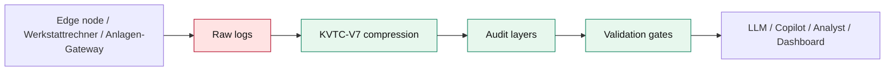

# 01 — System Overview

## Mission

**CompText V7** ist ein deterministisches Transport- und Audit-System für strukturierte technische Telemetrie. Es reduziert Tokenvolumen in repetitiven Diagnose-Logs, ohne die Review-Oberfläche auf eine undurchsichtige Zusammenfassung zu verkürzen. Das System richtet sich an Edge-nahe Diagnose-, Werkstatt-, Flotten- und industrielle Validierungsabläufe.

## Was CompText V7 ist

- Ein **verlustbehafteter, auditierbarer Kompressor** für strukturierte technische Logs.
- Ein **Cognitive-Fabric-Prototyp**, der vor LLM-, Copilot- oder Analytics-Handoffs laufen kann.
- Eine **deterministische Standard-Library-Implementierung** ohne zwingende Runtime-Abhängigkeiten.
- Ein **Validierungsrahmen** mit Golden Corpus, Replay, Forensik und Token-Telemetrie.

## Was CompText V7 nicht ist

- Kein Byte-für-Byte-Archivformat.
- Keine zertifizierte OEM- oder Produktionsfreigabe.
- Kein Ersatz für Domänenvalidierung mit echten Flotten-, Werkstatt- oder Anlagen-Daten.
- Keine generische Freitext-Zusammenfassung, die seltene Alarme wegoptimieren darf.

## Zielbild

## Kernnutzen

| Nutzen | Beschreibung | Kontrollpunkt |
| --- | --- | --- |
| Tokenökonomie | Repetitive Diagnosefamilien werden als Wörterbuch- und Zählstruktur transportiert. | Benchmark-Suite und Token-Telemetrie. |
| Auditierbarkeit | Header, Familien, Fenster und Frame bleiben separat inspizierbar. | `CompressionResult` und `explain_layers`. |
| Determinismus | Gleiche Eingaben erzeugen stabile Hashes und Frames. | Replay-Validierung und Golden Corpus. |
| Edge-Fähigkeit | Standard-Library-Implementierung kann vor Cloud-/Modell-Handoff laufen. | Keine Pflichtabhängigkeiten im Kern. |
| Governance | Kritische und hohe semantische Verluste sind Release-Blocker. | Forensik-Audit mit Nulltoleranz. |

## Personas

| Persona | Fragestellung | Wiki-Pfad |
| --- | --- | --- |
| Reviewer | Was ist die Systemgrenze und wo entstehen Risiken? | Overview → Governance |
| Entwickler | Wie entstehen Familien, Bursts und Payloads? | Architecture → KVTC Engine |
| QA/Compliance | Welche Checks blockieren Releases? | Validation → Runbook |
| Operations | Wie starte ich Benchmarks und Dashboard? | Runbook |
| Produkt/Management | Welche Fähigkeiten sind fertig, welche Roadmap offen? | Overview → Roadmap |

## Systemzustand

Der aktuelle Stand ist ein synthetisch validierter Forschungs- und Review-Prototyp. Die Repository-Berichte dokumentieren deterministische Corpus-Hashes, Forensik-Ergebnisse, Token-Drift-Sentinels, Replay-Stabilität und industrielle Readiness-Einschätzung. Aussagen zu Produktivwert, Sicherheit oder Wirtschaftlichkeit müssen durch reale Pilotdaten ergänzt werden.
