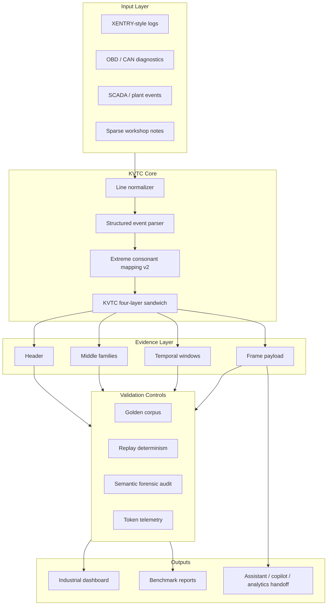
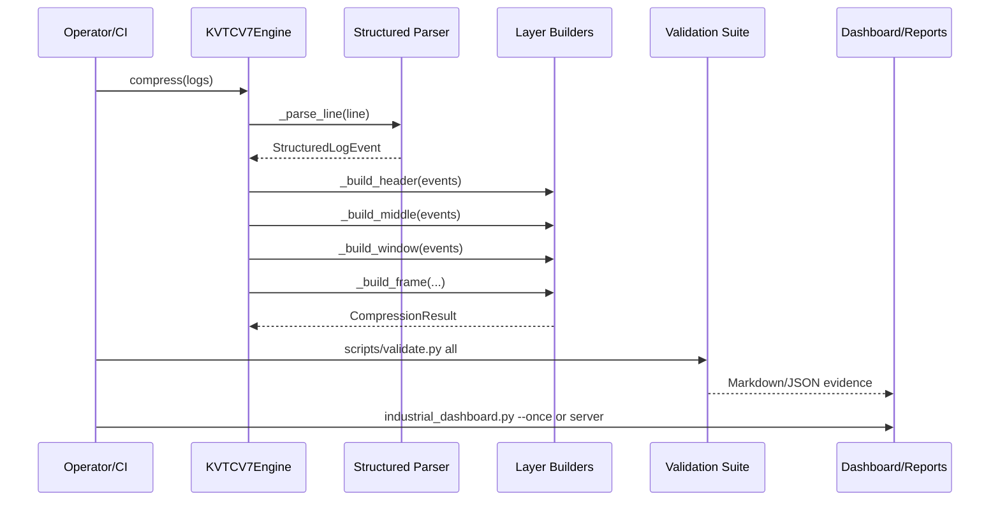
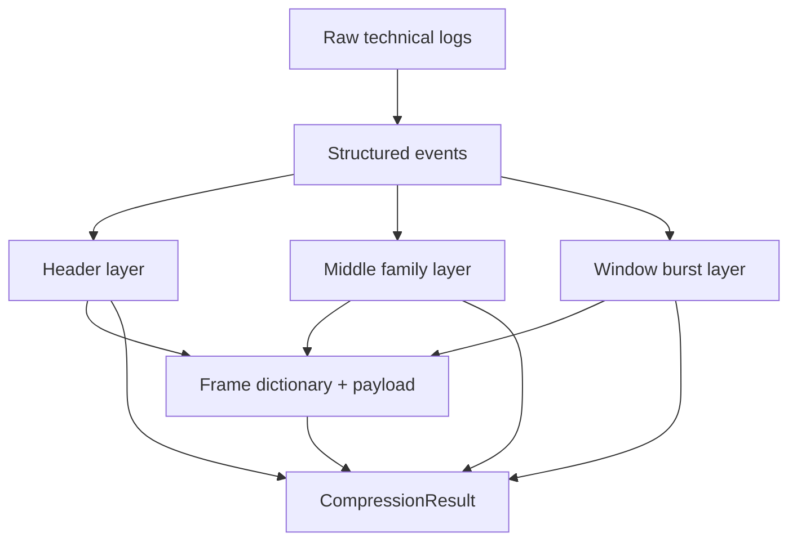
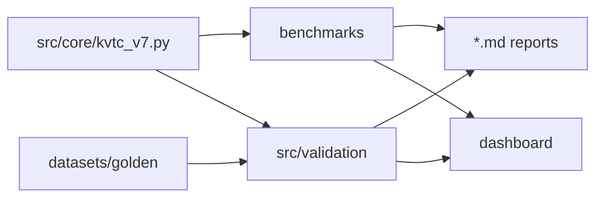

# 02 — Architecture and Dataflow

## High-Level-Architektur

## Datenfluss in Phasen

| Phase | Aufgabe | Ergebnis |
| --- | --- | --- |
| 1. Normalisieren | Eingabe als String oder Iterable in Zeilen zerlegen. | Stabile Zeilenfolge. |
| 2. Parsen | Zeitstempel, Severity, ECU/Modul, Codes und Key-Value-Felder extrahieren. | `StructuredLogEvent` pro Logzeile. |
| 3. Signieren | Low-Entropy-Prefixe entfernen, Konsonanten-/Domänensignatur bilden. | Familienfähige Event-Signatur. |
| 4. Schichten bauen | Header, Middle, Window und Frame erzeugen. | Auditierbares KVTC-Sandwich. |
| 5. Validieren | Replay, Golden Corpus, Forensik und Token-Telemetrie prüfen. | Release-fähige Evidenz oder Blocker. |
| 6. Ausgeben | Payload, Reports, Dashboard oder downstream Handoff bereitstellen. | Kompakte Transport- und Review-Artefakte. |

## Sequenzdiagramm

## Schichtenmodell

## Trust Boundaries

| Grenze | Risiko | Gegenmaßnahme |
| --- | --- | --- |
| Rohdaten → Parser | PII, FIN/VIN, Werkstattnotizen oder sensible Anlagenkontexte können in Rohlogs liegen. | KVTC am Edge ausführen; Sanitizing vor externem Handoff ergänzen. |
| Parser → Kompression | Seltene Alarme könnten von aggressiver Kompression verdeckt werden. | Sparse-Micro-Frame, Forensik-Gates, Golden-Corpus-Tests. |
| Kompression → LLM | Modell könnte Payload falsch interpretieren. | Audit-Layer mitgeben; keine Payload ohne Kontext als Vollrekonstruktion deklarieren. |
| Benchmark → Management-Aussage | Hohe Reduktion kann bei High-Entropy-Daten irreführend sein. | Top-Family-Coverage und Forensikmetriken gemeinsam berichten. |

## Repository-Mapping

