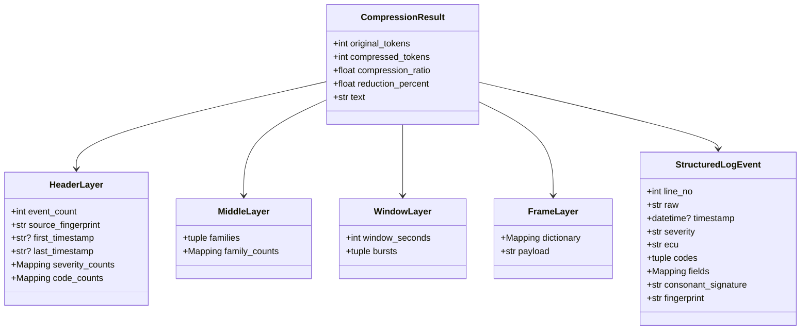
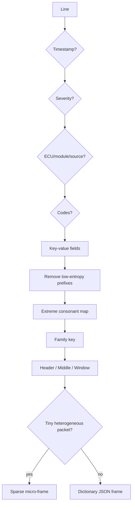
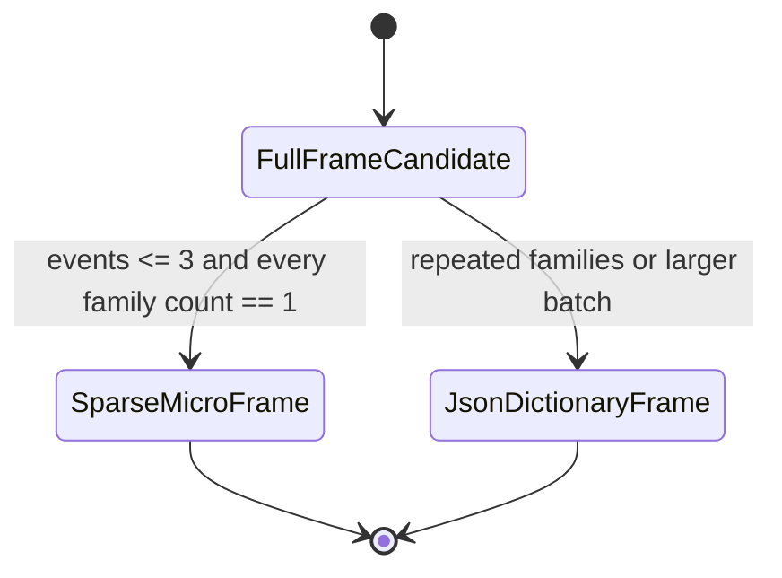

# 03 — KVTC Engine

## Engine Contract

Die öffentliche Kern-API ist bewusst klein: `KVTCV7Engine.compress(logs)` nimmt einen String oder ein Iterable von Zeilen entgegen und liefert ein `CompressionResult`. Dieses Resultat enthält Tokenzahlen, Reduktionsquote, die vier KVTC-Schichten, das transportierbare Payload-Textfeld und die intern geparsten Events.

## Interne Datenobjekte

## Four-Layer-Sandwich

| Layer | Zweck | Typische Inhalte | Review-Frage |
| --- | --- | --- | --- |
| Header | Laufweite Metadaten und Inventar. | Eventanzahl, Hash, Zeitbereich, Severity- und Code-Zählung. | Passt die Quelle, der Zeitraum und die Alarmverteilung? |
| Middle | Häufigste Diagnosefamilien. | `ECU:severity:primary-code:signature:fields`. | Welche Muster dominieren den Logstrom? |
| Window | Zeitliche Burst-Struktur. | Fensterbucket mit Familienzählung. | Wann clustern Fehler oder Alarme? |
| Frame | Kompakter Transport. | Dictionary plus JSON-Payload oder Micro-Frame. | Ist der Payload klein, stabil und auditierbar? |

## Kompressionslogik

## Extreme Consonant Mapping v2

Die Signaturbildung reduziert natürliche Sprache aggressiv und schützt gleichzeitig diagnostisch relevante Anker:

- OBD/DTC/SPN/FMI-Codes bleiben als hochentropische Diagnoseanker erhalten.
- Domänenbegriffe wie `temperature`, `pressure`, `voltage`, `brake` oder `diagnostic` werden in stabile Kurzformen überführt.
- Messwerte können exakt erhalten oder im Familienmodus zu Einheitsslots wie `#C`, `#V`, `#BAR` generalisiert werden.
- Kontextfelder wie `ecu`, `module` und `source` werden separat geführt, damit sie Familien nicht doppelt aufblähen.

## Sparse Micro-Frame

Für bis zu drei heterogene Ereignisse kann ein vollständiger JSON-Frame mehr Metadaten als Nutzen erzeugen. In diesem Fall nutzt die Engine eine deterministische Micro-Frame-Repräsentation, während Header, Middle und Events im `CompressionResult` weiterhin auditierbar bleiben.

## Beispiel-Payload-Typen

| Typ | Wann | Form |
| --- | --- | --- |
| Dictionary JSON Frame | Wiederholte oder größere strukturierte Logmengen. | Kompaktes JSON mit `v`, `h`, `d`, `m`, `w`. |
| Sparse Micro-Frame | Sehr kleine heterogene Triage-Pakete. | Pipe-getrennte Kurzform mit Event-Synopsis. |

## Erweiterungsleitlinien

1. Neue Parser-Regeln müssen deterministisch sein.
2. Neue Domänenbegriffe gehören in eine stabile Mapping-Tabelle und brauchen Regressionstests.
3. Nie Alarme, Severity, Zeitstempel oder Event-Reihenfolge abschwächen.
4. Änderungen an Frame-Format oder Tokenzählung müssen Golden-Corpus-, Replay- und Forensik-Erwartungen aktualisieren.
5. Neue Daten-Domänen sollten eigene Golden-Fixtures erhalten, statt bestehende Fixtures in-place zu ändern.
