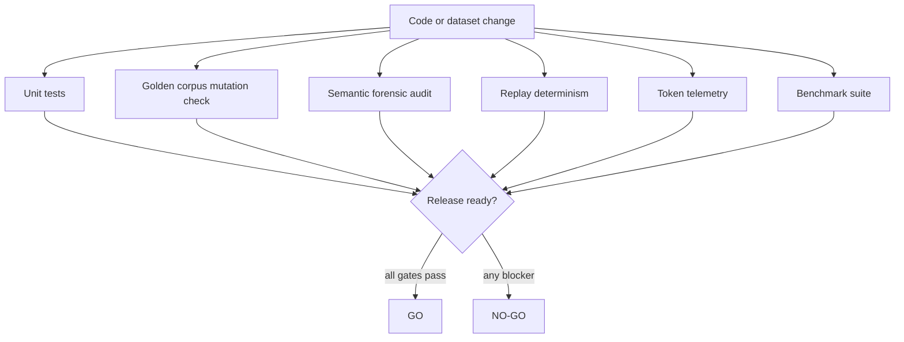
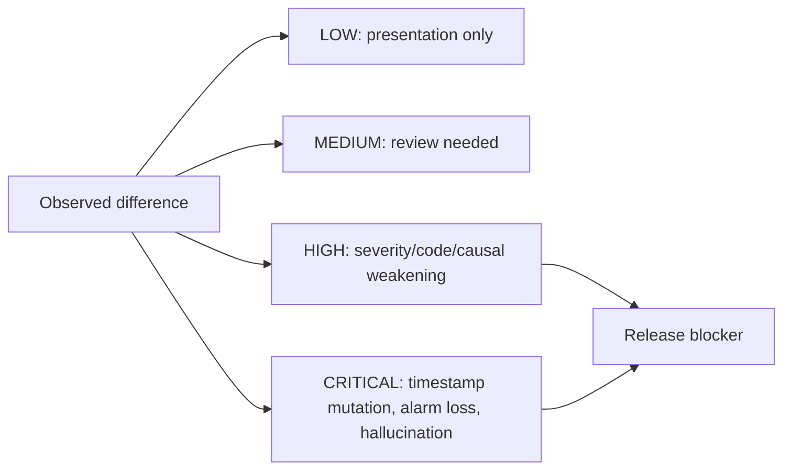

# 04 — Validation and Governance

## Validierungsziel

CompText V7 darf nicht nur durch hohe Kompressionsraten bewertet werden. Der Release-Ansatz kombiniert Tokenersparnis mit semantischer Retention, Replay-Stabilität, Drift-Klassifikation und Golden-Corpus-Integrität.

## Kontrollsystem

## Nicht verhandelbare Invarianten

| Invariante | Bedeutung |
| --- | --- |
| Alarme verschwinden nie. | Kritische oder sparse Signale müssen transportiert und auditierbar bleiben. |
| Zeitstempel bleiben unverändert. | Timeline- und Kausalitätsanalysen dürfen nicht mutieren. |
| Event-Reihenfolge bleibt unverändert. | Replay und Forensik müssen dieselbe Ereignisfolge sehen. |
| Sparse Anomalien überleben Routing und Replay. | Micro-Frame-Pfade sind Teil des Safety-Konzepts. |
| Rekonstruktion halluziniert nicht. | Keine erfundenen Events, Ursachen, Labels, Zeitstempel oder Operatoren. |
| Severity wird nicht weichgezeichnet. | `CRIT`, `ERR`, `WARN` müssen korrekt erhalten bleiben. |
| Deterministisches Replay ist Pflicht. | Gleiche Fixtures müssen stabile Hashes liefern. |
| Kritische/hohe Verluste sind nulltoleriert. | `MAX_ALLOWED_CRITICAL_LOSS = 0`, `MAX_ALLOWED_HIGH_LOSS = 0`. |

## Validierungsartefakte

| Artefakt | Quelle | Zweck |
| --- | --- | --- |
| Golden Corpus | `datasets/golden/` und `GOLDEN_CORPUS.md` | Unveränderliche Referenzdaten mit SHA256-Hashes. |
| Forensic Audit | `src/validation/forensic.py` | Prüft semantische Retention, Anomalie-, Anchor- und Safety-Erhalt. |
| Replay Summary | `src/validation/replay.py` und `reports/replay_summary.json` | Prüft deterministische Hash-Stabilität über Wiederholungen. |
| Token Telemetry | `src/validation/token_telemetry.py` | Dokumentiert Tokenizer-Version und Drift-Fingerprint. |
| Validation Report | `VALIDATION_REPORT.md` | Zusammenfassung des gehärteten Validierungsstands. |
| Industrial Readiness | `INDUSTRIAL_READINESS.md` | Go/No-Go-Einschätzung für synthetische industrielle Research-Readiness. |

## Drift-Klassifikation

## Benchmark-Governance

| Metrik | Aussage | Vorsicht |
| --- | --- | --- |
| Reduction Percent | Tokenersparnis gegenüber Rohlogs. | Allein keine Semantikgarantie. |
| Distinct Families | Anzahl unterschiedlicher Diagnosefamilien. | Viele Familien können auf High Entropy hinweisen. |
| Top-Family Coverage | Anteil, den die Top-Familien abdecken. | Niedrige Coverage bedeutet: Reduktion kritisch interpretieren. |
| Median ms / Lines/s | Lokale Laufzeitcharakteristik. | Hardware- und Python-Version beeinflussen Werte. |
| Peak KiB | Speicherprofil der Kompression. | Nur im Kontext der Batchgröße interpretieren. |

## Release-Checkliste

- [ ] `python -m pytest` erfolgreich.
- [ ] `python scripts/validate.py all` erfolgreich oder bekannte Umgebungseinschränkung dokumentiert.
- [ ] Golden-Corpus-Dateien nicht in-place mutiert.
- [ ] Forensik: keine High- oder Critical-Findings.
- [ ] Replay: stabile Hashes über wiederholte Durchläufe.
- [ ] Token-Telemetrie: Tokenizer-Version und Drift-Fingerprint dokumentiert.
- [ ] Benchmark-Ergebnisse mit Coverage-Hinweis interpretiert.
- [ ] README und Wiki aktualisiert, falls sich API, Befehle oder Architektur ändern.
