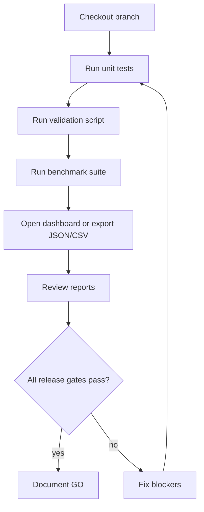

# 05 — Operations Runbook

## Voraussetzungen

- Python 3.11 oder neuer.
- Keine Pflichtabhängigkeiten für die Kernengine.
- Optional: `pytest` für Tests, `tiktoken` für modellnähere Tokenzählung.

## Schnellstart

```bash
python -m pytest
```

```bash
python benchmarks/run_kvtc_v7_benchmarks.py --iterations 5 --warmups 1
```

```bash
python scripts/validate.py all
```

## Dashboard

Das Dashboard läuft ohne externes Web-Framework und bietet HTML-, JSON- und CSV-Ansichten.

```bash
python dashboard/industrial_dashboard.py --once
```

```bash
python dashboard/industrial_dashboard.py --host 127.0.0.1 --port 8080
```

## Operativer Ablauf



## Befehlsreferenz

| Aufgabe | Befehl | Ergebnis |
| --- | --- | --- |
| Tests | `python -m pytest` | Unit- und Regressionstests. |
| Benchmark | `python benchmarks/run_kvtc_v7_benchmarks.py --iterations 5 --warmups 1` | Tabellenbasierte Kompressions- und Performancewerte. |
| Benchmark JSON | `python benchmarks/run_kvtc_v7_benchmarks.py --iterations 5 --warmups 1 --json` | Maschinenlesbares Benchmark-Artefakt. |
| Industrial Audit | `python benchmarks/run_industrial_audit.py --iterations 3` | Business-facing Readiness-Probes. |
| Golden Corpus | `python scripts/validate.py golden` | Hash-/Mutation-Check der Fixtures. |
| Forensic Audit | `python scripts/validate.py forensic` | Semantische Retention und Drift-Findings. |
| Replay | `python scripts/validate.py replay` | Determinismus-Zusammenfassung. |
| Token | `python scripts/validate.py token` | Tokenizer-Version und Drift-Fingerprint. |
| Alles | `python scripts/validate.py all` | Vollständiger lokaler Release-Gate-Durchlauf. |

## Troubleshooting

| Symptom | Mögliche Ursache | Vorgehen |
| --- | --- | --- |
| Tokenizer meldet `fallback-regex`. | `tiktoken` ist nicht installiert. | Für deterministische lokale Checks akzeptabel; für modellnähere Zählung `tiktoken` installieren. |
| Golden-Corpus-Check blockiert. | Fixture wurde in-place verändert. | Änderung rückgängig machen oder versionierte neue Fixture plus Dokumentation ergänzen. |
| Forensik findet HIGH/CRITICAL. | Alarm, Zeitstempel, Severity, Code oder Anchor ging verloren. | Parser/Mapping/Frame-Pfad korrigieren; keine Schwelle anheben. |
| High-Entropy-Benchmark zeigt hohe Reduktion. | Aggressive Zusammenfassung statt echte semantische Wiederholung. | Top-Family-Coverage und Forensikmetriken prominent berichten. |
| Dashboard startet nicht. | Port belegt oder Umgebung lässt Server nicht zu. | `--once` für einmaligen Export verwenden oder anderen Port wählen. |

## Review-Paket für Pull Requests

1. Zusammenfassung der Code-/Dokumentationsänderung.
2. Test- und Validierungsbefehle mit Ergebnis.
3. Hinweis auf veränderte Frame-, Parser-, Token- oder Fixture-Semantik.
4. Aktualisierte README-/Wiki-Verweise, falls sich Bedienung oder Architektur geändert hat.
5. Bei wahrnehmbarer Web-UI-Änderung: Screenshot oder Exportartefakt beilegen.
