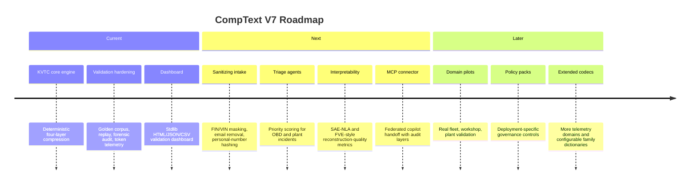
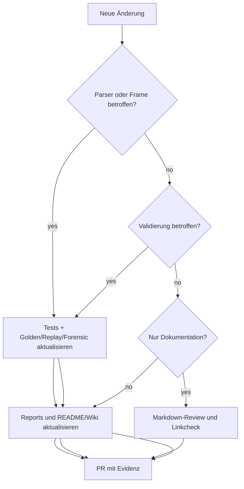

# 06 — Roadmap and Glossary

## Roadmap-Übersicht

## Capability Matrix

| Capability | Status | Hinweis |
| --- | --- | --- |
| KVTC-V7 Core | Implementiert | Deterministisch und Standard-Library-only. |
| Four-Layer Audit Surface | Implementiert | Header, Middle, Window, Frame. |
| Sparse Micro-Frame | Implementiert | Für kleine heterogene Triage-Pakete. |
| Benchmarks | Implementiert | Synthetische starke, mittlere, schwache und sparse Fälle. |
| Golden Corpus | Implementiert | JSONL-Fixtures mit Hash-Governance. |
| Forensic Audit | Implementiert | Nulltoleranz für High/Critical-Verlust. |
| Dashboard | Implementiert | HTML, JSON und CSV ohne Web-Framework. |
| Sanitizing Intake | Roadmap | In Projektgedächtnis vorgesehen. |
| Agents / MCP | Roadmap | Noch nicht Teil der aktuellen Implementierung. |

## Glossar

| Begriff | Bedeutung |
| --- | --- |
| KVTC | Kompakte hierarchische Repräsentation technischer Logs mit Audit-Schichten. |
| Cognitive Fabric | Konzeptuelle Transport- und Interpretierbarkeitsschicht zwischen Rohdaten und Assistenzsystemen. |
| Header Layer | Laufweite Metadaten wie Eventanzahl, Hash, Zeitspanne, Severity- und Code-Zählungen. |
| Middle Layer | Frequenzsortierte Diagnosefamilien zur Wiederholungsreduktion. |
| Window Layer | Zeitliche Burst-Zusammenfassung über Ereignisfenster. |
| Frame Layer | Transportpayload als Dictionary-JSON oder Sparse Micro-Frame. |
| Extreme Consonant Mapping | Aggressive Textsignatur, die Vokale entfernt, Domänenbegriffe abkürzt und Messwerte generalisieren kann. |
| Family Key | Stabiler Fingerprint für ähnliche technische Ereignisse. |
| Sparse Micro-Frame | Kurzer Payload-Pfad für sehr kleine heterogene Logpakete. |
| Golden Corpus | Unveränderliche Referenzfixtures für deterministische Regressionstests. |
| Forensic Audit | Prüfung, ob semantische Anker, Alarme und Safety-Signale erhalten bleiben. |
| Token Drift | Änderung in Tokenzählung oder Tokenizer-Verhalten, die Vergleichbarkeit beeinflusst. |
| Top-Family Coverage | Anteil der Events, die von den wichtigsten Familien abgedeckt werden. |

## Entscheidungsbaum für neue Beiträge

## Dokumentationsprinzipien

- Architekturdiagramme werden als Mermaid in Markdown gepflegt.
- Befehle müssen kopierbar und vom Repository-Root aus ausführbar sein.
- Validierungsaussagen brauchen Artefakt- oder Reportbezug.
- Roadmap-Punkte werden klar von implementierten Fähigkeiten getrennt.
- Risiken und Caveats bleiben sichtbar, auch wenn Benchmarks hohe Reduktion zeigen.
