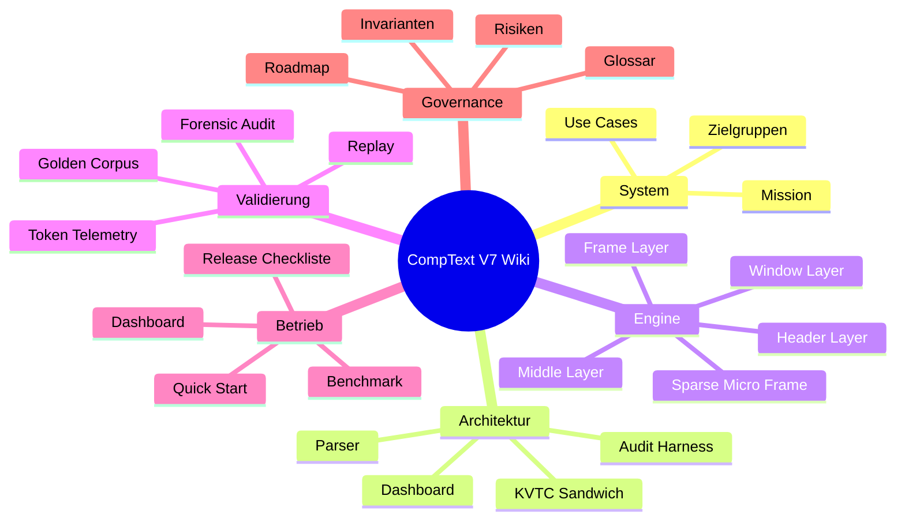
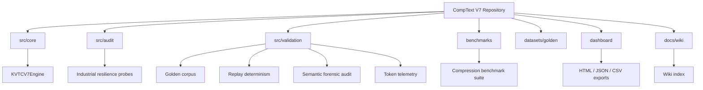

# CompText V7 Wiki

Willkommen im strukturierten Wiki für **CompText V7**, den deterministischen KVTC-Cognitive-Fabric-Prototyp für technische Diagnose- und Industrie-Logs. Dieses Wiki bündelt Architektur, Bedienung, Validierung, Governance und Review-Pfade an einem zentralen Ort.

> **Kurzfassung:** CompText V7 wandelt XENTRY-/OBD-/SCADA-nahe Logzeilen in ein kompaktes, auditierbares KVTC-Frame um. Die Kompression ist bewusst verlustbehaftet, aber deterministisch, messbar und durch Golden-Corpus-, Replay- und Forensik-Gates abgesichert.

## Wiki-Index

| Bereich | Einstieg | Zielgruppe |
| --- | --- | --- |
| Systemüberblick | [01 — System Overview](01-system-overview.md) | Produkt, Architektur, Review |
| Architektur & Datenfluss | [02 — Architecture and Dataflow](02-architecture-and-dataflow.md) | Engineering, Security, Integrationen |
| KVTC Engine | [03 — KVTC Engine](03-kvtc-engine.md) | Entwickler, Auditoren |
| Validierung & Governance | [04 — Validation and Governance](04-validation-and-governance.md) | QA, Compliance, Release-Gates |
| Betrieb & Runbook | [05 — Operations Runbook](05-operations-runbook.md) | CI, Ops, Dashboard-Nutzer |
| Roadmap & Glossar | [06 — Roadmap and Glossary](06-roadmap-and-glossary.md) | Projektleitung, neue Contributor |

## Navigationskarte

## Wichtigste Artefakte im Repository

| Artefakt | Zweck |
| --- | --- |
| `src/core/kvtc_v7.py` | Deterministische KVTC-V7-Kompressionsengine. |
| `benchmarks/run_kvtc_v7_benchmarks.py` | Synthetische Performance- und Reduktions-Benchmarks. |
| `src/validation/` | Golden-Corpus-, Replay-, Token- und Forensik-Validierung. |
| `dashboard/industrial_dashboard.py` | Lokales HTML/JSON/CSV-Dashboard ohne externe Web-Frameworks. |
| `program.md` | Operative Doktrin und nicht verhandelbare Sicherheitsinvarianten. |
| `GOLDEN_CORPUS.md` | Hashes und Governance-Regeln für unveränderliche Replay-Fixtures. |

## Gesamtstruktur

## Leseempfehlung

1. Starte mit dem [Systemüberblick](01-system-overview.md), wenn du CompText V7 fachlich einordnen willst.
2. Lies [Architektur & Datenfluss](02-architecture-and-dataflow.md), wenn du Integrationen, Datenwege oder Sicherheitsgrenzen bewertest.
3. Nutze [KVTC Engine](03-kvtc-engine.md), wenn du den Code ändern oder das Frame-Format prüfen willst.
4. Nutze [Validierung & Governance](04-validation-and-governance.md), bevor du Benchmark- oder Release-Aussagen triffst.
5. Folge dem [Runbook](05-operations-runbook.md), um Tests, Benchmarks, Dashboard und Release-Checks reproduzierbar auszuführen.
